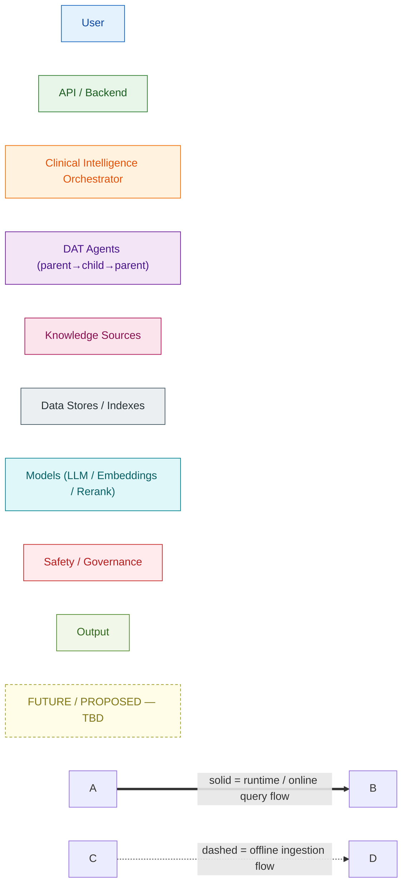
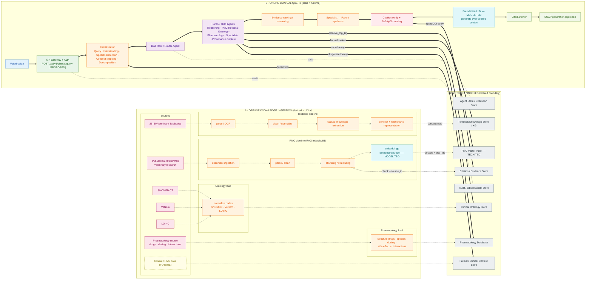
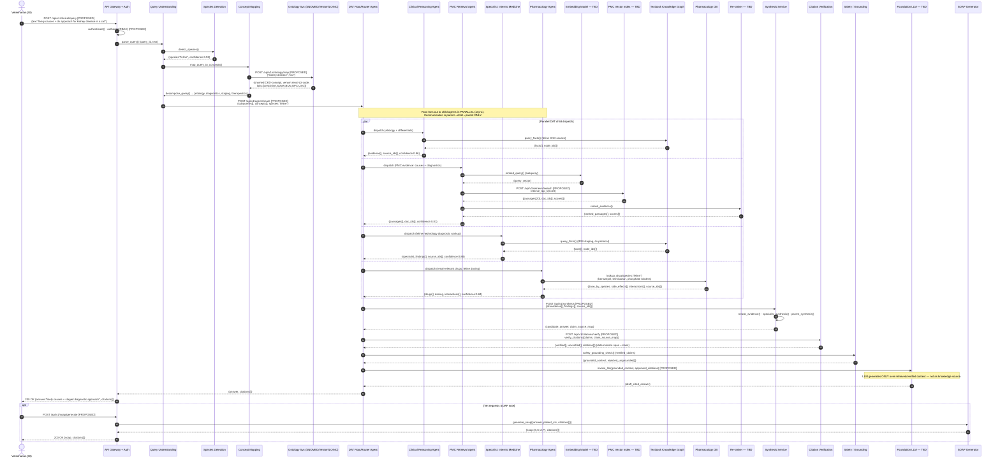

# Veterinary Clinical Intelligence Platform — End‑to‑End Architecture

> **Source of truth:** the architecture specification for this platform (RAG grounding, SNOMED CT / VeNom / LOINC ontologies, species‑specific pharmacology, specialist avatars, deterministic citation, and **DAT** — hierarchical *Directed‑Acyclic‑Tree* parent→child orchestration, **not** a flat multi‑agent mesh and **not** a simple sequential RAG pipeline).
>
> **`PROPOSED — TBD` rule:** where the source does **not** define a production endpoint, model, framework, cloud provider, vector database or storage technology, it is labelled `PROPOSED` / `TBD` rather than invented. The LLM is **never** the knowledge source — it *generates over retrieved, verified context*.

This document contains **exactly 5 diagrams**:

| # | Diagram | Purpose |
|---|---------|---------|
| 1 | **High‑Level Architecture** | Layered system view: User → API → Orchestrator → DAT → Knowledge → Stores → Models → Safety → Output |
| 2 | **Low‑Level / Detailed Architecture** | Every connection labelled with protocol, payloads, sync/async, auth boundary, retrieval mechanism, model invocation, store accessed |
| 3 | **E2E System Flow** | Two distinct flows — (A) **Offline Knowledge Ingestion** (dashed) and (B) **Online Clinical Query** (solid) |
| 4 | **Sequential Diagram** | Chronological trace for *"likely causes and diagnostic approach for kidney disease in a cat"* |
| 5 | **Veterinarian User Flow** | The vet's real journey from login to SOAP export |

---

## Legend (applies to all diagrams)

**Line semantics:** `═══▶` **solid** = runtime / online query flow &nbsp;•&nbsp; `– – ▶` **dashed** = offline ingestion flow &nbsp;•&nbsp; dashed‑border boxes = **FUTURE / PROPOSED — TBD**.

---

## 1 · High‑Level Architecture

Left‑to‑right primary flow. Each visual group is a bounded layer. The **DAT** block expands fully in Diagram 2.

```mermaid
flowchart LR
  classDef user   fill:#E3F2FD,stroke:#1565C0,color:#0D47A1;
  classDef api    fill:#E8F5E9,stroke:#2E7D32,color:#1B5E20;
  classDef orch   fill:#FFF3E0,stroke:#EF6C00,color:#E65100;
  classDef dat    fill:#F3E5F5,stroke:#6A1B9A,color:#4A148C;
  classDef know   fill:#FCE4EC,stroke:#AD1457,color:#880E4F;
  classDef store  fill:#ECEFF1,stroke:#455A64,color:#263238;
  classDef model  fill:#E0F7FA,stroke:#00838F,color:#006064;
  classDef safety fill:#FFEBEE,stroke:#C62828,color:#B71C1C;
  classDef out    fill:#F1F8E9,stroke:#558B2F,color:#33691E;
  classDef future fill:#FFFDE7,stroke:#9E9D24,color:#827717,stroke-dasharray:4 3;

  subgraph U["1 · USER"]
    VET["Veterinarian<br/>text · question · image · patient/species context"]:::user
  end

  subgraph API["2 · API / BACKEND"]
    direction TB
    GW["API Gateway + AuthN/AuthZ<br/>POST /api/v1/clinical/query  (PROPOSED)<br/>OIDC/JWT · RBAC · rate‑limit"]:::api
    SESS["Session / Case Service<br/>patient + case context"]:::api
  end

  subgraph ORCH["3 · CLINICAL INTELLIGENCE ORCHESTRATOR"]
    direction TB
    QU["Query Understanding Agent"]:::orch
    SPEC_DET["Species Detection"]:::orch
    CMAP["Clinical Entity / Concept Mapping<br/>→ SNOMED CT · VeNom · LOINC"]:::orch
    QDEC["Query Decomposition"]:::orch
  end

  subgraph DATG["4 · DAT AGENTS  (Directed Acyclic Tree)"]
    direction TB
    ROOT["Root / Router Agent"]:::dat
    CR["Clinical Reasoning Agent"]:::dat
    LIT["Literature / PMC Retrieval Agent"]:::dat
    ONTA["Ontology / Concept Agent"]:::dat
    PH["Pharmacology Agent"]:::dat
    SPS["Specialist Agents<br/>Internal Medicine · Oncology · Anesthesia · Dentistry"]:::dat
    PROV["Provenance Capture Agent<br/>records source_id ↔ span"]:::dat
    ROOT --> CR & LIT & ONTA & PH & SPS & PROV
  end

  subgraph SYN["5 · EVIDENCE / SYNTHESIS"]
    RANK["Evidence Ranking / Re‑ranking"]:::orch
    SSYN["Specialist Synthesis"]:::orch
    PSYN["Parent‑Agent Synthesis"]:::orch
  end

  subgraph KNOW["6 · KNOWLEDGE SOURCES"]
    direction TB
    TB["25–30 Veterinary Textbooks"]:::know
    PMC["PubMed Central (PMC)<br/>veterinary research"]:::know
    SNO["SNOMED CT"]:::know
    VEN["VeNom codes"]:::know
    LOI["LOINC"]:::know
    PHS["Pharmacology DB source<br/>drugs · species dosing · interactions"]:::know
    PMS["Clinical / PMS / EHR data<br/>(FUTURE)"]:::future
  end

  subgraph STORE["7 · DATA STORES / INDEXES"]
    direction TB
    KG["Textbook Knowledge Store /<br/>Knowledge Graph"]:::store
    VIDX["PMC Vector Index<br/>Vector DB — TECHNOLOGY TBD"]:::store
    ONTS["Clinical Ontology Store<br/>SNOMED/VeNom/LOINC"]:::store
    PHDB["Pharmacology Database"]:::store
    CES["Citation / Evidence Store"]:::store
    PCS["Patient / Clinical Context Store"]:::store
    ASE["Agent State / Execution Store"]:::store
    AOS["Audit / Observability Store"]:::store
  end

  subgraph MODELS["8 · MODELS"]
    direction TB
    LLM["Foundation LLM — MODEL TBD<br/>generates over retrieved context (NOT a knowledge source)"]:::model
    EMB["Embedding Model — MODEL TBD"]:::model
    RRK["Re‑ranker Model — MODEL TBD"]:::model
  end

  subgraph GOV["9 · SAFETY / GOVERNANCE"]
    direction TB
    CVER["Citation Mapping + Deterministic Verification"]:::safety
    SGRD["Clinical Safety / Grounding Checks"]:::safety
  end

  subgraph OUT["10 · OUTPUT"]
    direction TB
    ANS["Final Cited Clinical Answer"]:::out
    SOAP["SOAP Generator / Workflow<br/>POST /api/v1/soap/generate  (PROPOSED)"]:::out
    EXP["Export to PMS / EHR<br/>(FUTURE)"]:::future
  end

  %% ---- primary left-to-right runtime flow ----
  VET ==>|"HTTPS request"| GW
  GW ==> SESS ==> QU
  QU ==> SPEC_DET ==> CMAP ==> QDEC ==> ROOT

  %% DAT children reach knowledge via stores + models
  LIT ==>|"retrieve_top_k()"| VIDX
  ONTA ==> ONTS
  CR ==> KG
  PH ==> PHDB
  SPS ==> KG

  VIDX ==> RANK
  RRK -. scores .- RANK
  RANK ==> SSYN ==> PSYN
  PROV -. writes .- CES
  PSYN ==> CVER ==> SGRD ==> LLM ==> ANS ==> SOAP -.-> EXP

  %% models used by orchestrator/agents
  EMB -. embeds query .- QU
  CVER -. reads .- CES

  %% context + audit are cross-cutting
  SESS -. read/write .- PCS
  ROOT -. state .- ASE
  GW -. logs .- AOS

  %% offline ingestion (dashed) feeding stores
  TB -.->|"ingest"| KG
  PMC -.->|"ingest → chunk → embed"| VIDX
  SNO -.-> ONTS
  VEN -.-> ONTS
  LOI -.-> ONTS
  PHS -.-> PHDB
  PMS -.-> PCS
```

---

## 2 · Low‑Level / Detailed Architecture

**True DAT hierarchy** shown explicitly: `Root/Router → child specialist/retrieval agents → back to Root`. Communication is **only** parent↔child; there is **no** arbitrary agent‑to‑agent traffic. Every child returns **structured evidence + source IDs + confidence/metadata** to its parent. Synthesis runs **after** retrieval. All undefined endpoints/models/tech are `PROPOSED / TBD`.

```mermaid
flowchart LR
  classDef user   fill:#E3F2FD,stroke:#1565C0,color:#0D47A1;
  classDef api    fill:#E8F5E9,stroke:#2E7D32,color:#1B5E20;
  classDef orch   fill:#FFF3E0,stroke:#EF6C00,color:#E65100;
  classDef dat    fill:#F3E5F5,stroke:#6A1B9A,color:#4A148C;
  classDef store  fill:#ECEFF1,stroke:#455A64,color:#263238;
  classDef model  fill:#E0F7FA,stroke:#00838F,color:#006064;
  classDef safety fill:#FFEBEE,stroke:#C62828,color:#B71C1C;
  classDef out    fill:#F1F8E9,stroke:#558B2F,color:#33691E;

  %% ============ AUTH BOUNDARY ============
  subgraph EDGE["API / BACKEND  — trust boundary: external → internal"]
    direction TB
    VET["Veterinarian client (Web/Mobile)"]:::user
    GW["API Gateway + Auth Service<br/>POST /api/v1/clinical/query  [PROPOSED]<br/>AuthN OIDC/JWT · AuthZ RBAC · TLS 1.2+"]:::api
    VET ==>|"HTTPS · REST/JSON · sync<br/>req: {vet_id, patient, species?, text, image?}<br/>resp: {answer, citations[], soap?}"| GW
  end

  %% ============ ORCHESTRATOR ============
  subgraph ORCH["CLINICAL INTELLIGENCE ORCHESTRATOR  (internal service mesh, mTLS)"]
    direction TB
    QU["Query Understanding Agent<br/>parse_query()"]:::orch
    SDET["Species Detection<br/>detect_species()"]:::orch
    CMAP["Concept Mapping<br/>map_query_to_concepts()"]:::orch
    ONTAPI["Ontology mapping<br/>POST /api/v1/ontology/map  [PROPOSED]<br/>→ SNOMED · VeNom · LOINC"]:::orch
    QDEC["Query Decomposition<br/>decompose_query()"]:::orch
    GW ==>|"gRPC/HTTP · JSON · sync<br/>{query_id, text, image_ref, patient_ctx}"| QU
    QU ==> SDET ==> CMAP ==> ONTAPI ==> QDEC
  end

  %% ============ DAT — ROOT/ROUTER ============
  subgraph DAT["DAT AGENT TREE  (parent→child→parent only)"]
    direction TB
    ROOT["Root / Router Agent<br/>POST /api/v1/agents/route  [PROPOSED]<br/>route_subqueries() · fan‑out to children · async"]:::dat

    subgraph CHILDREN["Child agents — invoked in PARALLEL by Root"]
      direction TB
      CR["Clinical Reasoning Agent<br/>reason_differentials()"]:::dat
      LIT["Literature / PMC Retrieval Agent<br/>retrieve_top_k() → rerank_evidence()"]:::dat
      ONTA["Ontology / Concept Agent<br/>expand_concepts()"]:::dat
      PH["Pharmacology Agent<br/>lookup_drug(species,dose)"]:::dat
      subgraph SPS["Specialist Agent(s)"]
        direction TB
        IM["Internal Medicine"]:::dat
        ONC["Oncology"]:::dat
        ANE["Anesthesia"]:::dat
        DEN["Dentistry"]:::dat
      end
      PROV["Provenance Capture Agent<br/>capture_provenance()<br/>source_id ↔ span"]:::dat
    end

    %% parent -> child (fan-out, async task dispatch)
    ROOT ==>|"dispatch subquery · async<br/>{subquery, concepts[], species}"| CR
    ROOT ==>|"dispatch · async"| LIT
    ROOT ==>|"dispatch · async"| ONTA
    ROOT ==>|"dispatch · async"| PH
    ROOT ==>|"dispatch · async"| SPS
    ROOT ==>|"dispatch · async"| PROV

    %% child -> parent (structured return)
    CR  ==>|"return {evidence[], source_ids[], confidence, metadata}"| ROOT
    LIT ==>|"return {passages[], doc_ids[], scores[], confidence}"| ROOT
    ONTA ==>|"return {codes[], concept_ids[], confidence}"| ROOT
    PH  ==>|"return {drugs[], dosing, interactions[], source_ids[]}"| ROOT
    SPS ==>|"return {specialist_findings[], source_ids[], confidence}"| ROOT
    PROV ==>|"return {provenance_written, source_ids[]}"| ROOT
  end

  %% ============ RETRIEVAL + STORES ============
  subgraph RET["RETRIEVAL MECHANISMS + DATA STORES"]
    direction TB
    VIDX["PMC Vector Index<br/>Vector DB — TECH TBD<br/>ANN top‑k similarity search"]:::store
    KG["Textbook Knowledge Store /<br/>Knowledge Graph<br/>graph + factual lookup"]:::store
    ONTS["Clinical Ontology Store<br/>SNOMED/VeNom/LOINC · code lookup"]:::store
    PHDB["Pharmacology Database<br/>SQL — TECH TBD"]:::store
    CES["Citation / Evidence Store<br/>source_id ↔ span/DOI/passage"]:::store
    PCS["Patient / Clinical Context Store"]:::store
    ASE["Agent State / Execution Store<br/>DAT run graph · task status"]:::store
    AOS["Audit / Observability Store<br/>traces · logs · metrics"]:::store
  end

  %% ============ MODELS ============
  subgraph MDL["MODELS"]
    direction TB
    EMB["Embedding Model — MODEL TBD<br/>embed_query() · async"]:::model
    RRK["Re‑ranker Model — MODEL TBD"]:::model
    LLM["Foundation LLM — MODEL TBD<br/>invoke_llm(context, citations)<br/>generates over verified context ONLY"]:::model
  end

  %% ============ SAFETY + OUTPUT ============
  subgraph GOV["SAFETY / GOVERNANCE + OUTPUT"]
    direction TB
    CVER["Citation Mapping + Verification<br/>POST /api/v1/citations/verify  [PROPOSED]<br/>deterministic span↔claim match"]:::safety
    SGRD["Clinical Safety / Grounding Checks<br/>reject ungrounded claims"]:::safety
    SYNTH["Synthesis Service<br/>POST /api/v1/synthesis  [PROPOSED]<br/>specialist → parent synthesis"]:::orch
    ANS["Final Cited Clinical Answer"]:::out
    SOAPG["SOAP Generator<br/>POST /api/v1/soap/generate [PROPOSED]<br/>generate_soap()"]:::out
  end

  %% ---- orchestrator entry into DAT ----
  QDEC ==>|"POST /api/v1/agents/route [PROPOSED] · sync‑await<br/>{subqueries[], concepts[], species, patient_ctx}"| ROOT

  %% ---- retrieval edges (labelled: mechanism / store) ----
  LIT ==>|"embed_query() · async"| EMB
  EMB ==>|"query vector [float]"| VIDX
  VIDX ==>|"POST /api/v1/retrieval/search [PROPOSED]<br/>top‑k passages + doc_ids + scores · sync"| LIT
  LIT ==>|"rerank_evidence()"| RRK
  CR  ==>|"graph/factual query · sync"| KG
  IM  ==>|"factual lookup · sync"| KG
  ONTA ==>|"code lookup · sync<br/>{term} → {snomed,venom,loinc}"| ONTS
  PH  ==>|"SQL/REST · sync<br/>{drug,species} → {dose,interactions}"| PHDB

  %% ---- return to synthesis + verification ----
  ROOT ==>|"POST /api/v1/synthesis [PROPOSED] · sync<br/>{ranked_evidence[], findings[], source_ids[]}"| SYNTH
  SYNTH ==>|"candidate answer + claim→source_id map"| CVER
  CVER ==>|"reads spans/DOIs · sync"| CES
  CVER ==>|"verified claims + citations[]"| SGRD
  SGRD ==>|"grounded context + approved citations"| LLM
  LLM  ==>|"draft cited answer · sync"| ANS
  ANS  ==>|"optional · generate_soap()"| SOAPG
  SOAPG ==>|"HTTPS · JSON · sync<br/>{soap: {S,O,A,P}, citations[]}"| GW

  %% ---- cross-cutting: state / context / audit / evidence ----
  ROOT -. read/write DAT run graph .- ASE
  QU  -. read patient context .- PCS
  LIT -. write source_ids/spans .- CES
  ROOT -. emit traces/spans .- AOS
  GW  -. access logs .- AOS
```

### 2a · Connection register (every runtime edge, fully attributed)

| # | Source → Destination | Protocol / Interface | Request payload | Response payload | Sync / Async | Format | Auth boundary | Retrieval mech. | Model invoked | Store / index |
|---|----------------------|----------------------|-----------------|------------------|--------------|--------|---------------|-----------------|---------------|---------------|
| 1 | Vet client → API Gateway | `POST /api/v1/clinical/query` **[PROPOSED]** | `{vet_id, patient, species?, text, image_ref?}` | `{answer, citations[], soap?}` | sync | JSON/HTTPS | **External→Internal** (OIDC/JWT, RBAC, TLS) | — | — | — |
| 2 | Gateway → Query Understanding | gRPC/HTTP internal (mTLS) | `{query_id, text, image_ref, patient_ctx}` | `{intent, entities[]}` | sync | JSON/protobuf | internal | — | — | Patient/Context Store (read) |
| 3 | Query Understanding → Embedding Model | `embed_query()` **[PROPOSED]** | `{text}` | `{vector[float]}` | async | tensor/JSON | internal | — | **Embedding — MODEL TBD** | — |
| 4 | Concept Mapping → Ontology Store | `POST /api/v1/ontology/map` **[PROPOSED]** | `{terms[], species}` | `{snomed[], venom[], loinc[]}` | sync | JSON | internal | code lookup | — | Clinical Ontology Store |
| 5 | Query Decomposition → Root/Router | `POST /api/v1/agents/route` **[PROPOSED]** | `{subqueries[], concepts[], species, patient_ctx}` | `{run_id}` (children dispatched) | sync‑await | JSON | internal | — | — | Agent State/Execution Store (write) |
| 6 | Root → each child agent | task dispatch **[PROPOSED]** (queue/RPC) | `{subquery, concepts[], species}` | — (async task) | **async fan‑out** | JSON | internal | — | — | Agent State Store |
| 7 | Literature Agent → Vector Index | `POST /api/v1/retrieval/search` **[PROPOSED]** | `{query_vector, k, filters}` | `{passages[], doc_ids[], scores[]}` | sync | JSON | internal | **ANN top‑k** | (Embedding upstream) | **PMC Vector Index — TECH TBD** |
| 8 | Literature Agent → Re‑ranker | `rerank_evidence()` **[PROPOSED]** | `{query, passages[]}` | `{ranked[], scores[]}` | sync | JSON | internal | cross‑encode rerank | **Re‑ranker — MODEL TBD** | — |
| 9 | Clinical Reasoning / Specialist → Knowledge Graph | graph/factual query **[PROPOSED]** | `{concepts[], relations[]}` | `{facts[], node_ids[]}` | sync | JSON/Cypher‑like | internal | graph traversal / factual lookup | — | Textbook Knowledge Store / KG |
| 10 | Ontology Agent → Ontology Store | code lookup | `{term}` | `{code_ids[], concept_ids[]}` | sync | JSON | internal | code lookup | — | Clinical Ontology Store |
| 11 | Pharmacology Agent → Pharmacology DB | SQL/REST **[PROPOSED]** | `{drug, species}` | `{generic, dose_by_species, side_effects[], interactions[]}` | sync | JSON/SQL | internal | keyed lookup | — | Pharmacology Database |
| 12 | Each child → Root (return) | structured return | — | `{evidence[], source_ids[], confidence, metadata}` | async→collected | JSON | internal | — | — | Agent State Store (write) |
| 13 | Root → Synthesis Service | `POST /api/v1/synthesis` **[PROPOSED]** | `{ranked_evidence[], findings[], source_ids[]}` | `{candidate_answer, claim_source_map}` | sync | JSON | internal | — | — | — |
| 14 | Synthesis → Citation Verification | `POST /api/v1/citations/verify` **[PROPOSED]** | `{claims[], claim_source_map}` | `{verified[], unverified[], citations[]}` | sync | JSON | internal | **deterministic span↔claim match** | — | Citation / Evidence Store (read) |
| 15 | Citation Verification → Safety/Grounding | internal call | `{verified_claims[], citations[]}` | `{grounded_context, rejects[]}` | sync | JSON | internal | grounding filter | — | — |
| 16 | Safety/Grounding → Foundation LLM | `invoke_llm()` **[PROPOSED]** | `{grounded_context, approved_citations[], prompt}` | `{draft_answer}` | sync | JSON | internal | — | **Foundation LLM — MODEL TBD** (generates over context only) | — |
| 17 | LLM → Final Answer → Gateway | internal → `POST /api/v1/clinical/query` resp | `{answer, citations[]}` | `{answer, citations[]}` | sync | JSON | Internal→External | — | — | — |
| 18 | Final Answer → SOAP Generator | `POST /api/v1/soap/generate` **[PROPOSED]** / `generate_soap()` | `{answer, patient_ctx, citations[]}` | `{soap:{S,O,A,P}, citations[]}` | sync (optional) | JSON | internal | — | (LLM optional) | — |
| X‑1 | Root ↔ Agent State/Execution Store | read/write DAT run graph | `{run_id, node, status}` | `{state}` | async | JSON | internal | — | — | Agent State/Execution Store |
| X‑2 | Retrieval agents → Citation/Evidence Store | write spans/DOIs | `{source_id, span, doc_id, uri}` | ack | async | JSON | internal | — | — | Citation / Evidence Store |
| X‑3 | Gateway / Root → Audit/Observability Store | emit traces & logs | `{trace_id, spans[], event}` | ack | async | JSON/OTLP | internal | — | — | Audit / Observability Store |

---

## 3 · E2E System Flow — two distinct flows

**Flow A (dashed)** = OFFLINE knowledge ingestion. **Flow B (solid)** = ONLINE clinical query. They meet only at the shared **Data Stores / Indexes**.

---

## 4 · Sequential Diagram

**Example query:** *"What are the likely causes and recommended diagnostic approach for kidney disease in a cat?"*
Every message shows the actual interface/action; `[PROPOSED]` marks undefined implementations. Species = **feline**; concept = **chronic kidney disease (CKD) / renal disease**.

---

## 5 · Veterinarian User Flow

The vet's real journey, from credential verification to (future) PMS/EHR export. Decision points and the deterministic citation review are shown explicitly.

```mermaid
flowchart TD
  classDef user   fill:#E3F2FD,stroke:#1565C0,color:#0D47A1;
  classDef api    fill:#E8F5E9,stroke:#2E7D32,color:#1B5E20;
  classDef sys    fill:#FFF3E0,stroke:#EF6C00,color:#E65100;
  classDef out    fill:#F1F8E9,stroke:#558B2F,color:#33691E;
  classDef dec    fill:#FFF8E1,stroke:#F9A825,color:#F57F17;
  classDef future fill:#FFFDE7,stroke:#9E9D24,color:#827717,stroke-dasharray:4 3;

  A["Login / credential verification<br/>OIDC/JWT · RBAC [PROPOSED]"]:::api
  B["Start New Clinical Query"]:::user
  C["Enter patient / species / context"]:::user
  D["Ask question · upload clinical data / image"]:::user
  E["Submit → POST /api/v1/clinical/query [PROPOSED]"]:::api

  F["System understands case<br/>Query Understanding · Species Detection ·<br/>Concept Mapping → SNOMED/VeNom/LOINC"]:::sys
  G["System retrieves evidence<br/>PMC Vector Index · Textbook KG ·<br/>Ontology · Pharmacology DB"]:::sys
  H["DAT coordinates specialists<br/>Root/Router → parallel child agents → Root"]:::sys
  I["Evidence synthesized<br/>rerank → specialist → parent synthesis"]:::sys
  J["Citation verification + safety/grounding<br/>then LLM generates over verified context"]:::sys

  K["Cited answer displayed"]:::out
  L{"Vet reviews sources /<br/>citations"}:::dec
  M{"Ask follow‑up?"}:::dec
  N{"Generate SOAP note?"}:::dec
  O["Generate SOAP<br/>POST /api/v1/soap/generate [PROPOSED]"]:::out
  P["Review / edit SOAP"]:::user
  Q["Save"]:::out
  R["Export to PMS / EHR<br/>(FUTURE)"]:::future

  A --> B --> C --> D --> E --> F --> G --> H --> I --> J --> K --> L
  L -->|"citations OK"| M
  L -->|"citation unclear → open source span"| K
  M -->|"yes → new subquery (context retained)"| E
  M -->|"no"| N
  N -->|"no"| Q
  N -->|"yes"| O --> P --> Q
  Q -.->|"FUTURE integration"| R
```

---

## Appendix A — `PROPOSED — TBD` register

Everything below is **not** defined in the source and is therefore explicitly marked, never invented.

| Category | Item | Status |
|----------|------|--------|
| Endpoint | `POST /api/v1/clinical/query` | **PROPOSED** |
| Endpoint | `POST /api/v1/retrieval/search` | **PROPOSED** |
| Endpoint | `POST /api/v1/agents/route` | **PROPOSED** |
| Endpoint | `POST /api/v1/synthesis` | **PROPOSED** |
| Endpoint | `POST /api/v1/citations/verify` | **PROPOSED** |
| Endpoint | `POST /api/v1/soap/generate` | **PROPOSED** |
| Endpoint | `POST /api/v1/ontology/map` | **PROPOSED** |
| Model | Foundation LLM | **MODEL TBD** (generator over verified context, **not** knowledge source) |
| Model | Embedding model | **MODEL TBD** |
| Model | Re‑ranker model | **MODEL TBD** |
| Technology | Vector database (PMC index) | **TECHNOLOGY TBD** |
| Technology | Knowledge Graph / textbook store engine | **TECHNOLOGY TBD** |
| Technology | Pharmacology DB engine | **TECHNOLOGY TBD** |
| Technology | Agent framework / orchestration runtime | **TECHNOLOGY TBD** |
| Technology | Cloud provider / deployment target | **TBD** |
| Data source | Veterinary clinical / PMS / EHR integration | **FUTURE** |

## Appendix B — Data store catalog (shown separately, per requirement)

| Store | Contents | Written by (offline) | Read by (online) |
|-------|----------|----------------------|------------------|
| **Textbook Knowledge Store / Knowledge Graph** | Extracted facts, concepts & relationships from 25–30 textbooks | Textbook pipeline | Clinical Reasoning & Specialist agents |
| **PMC Vector Index** *(Vector DB — TECH TBD)* | Embedded PMC research chunks + doc IDs | PMC pipeline (chunk → embed) | Literature/PMC Retrieval Agent (`retrieve_top_k`) |
| **Clinical Ontology Store** | SNOMED CT, VeNom, LOINC codes & mappings | Ontology load | Concept Mapping + Ontology/Concept Agent |
| **Pharmacology Database** | Generic drugs, species‑specific dosing, side effects, interactions | Pharmacology load | Pharmacology Agent |
| **Citation / Evidence Store** | `source_id ↔ span / DOI / passage` provenance | PMC pipeline | Citation Verification Agent (deterministic) |
| **Patient / Clinical Context Store** | Case/patient/species context | Session service / (FUTURE PMS) | Orchestrator (patient ctx) |
| **Agent State / Execution Store** | DAT run graph, task status, per‑node results | — | Root/Router + all agents (state) |
| **Audit / Observability Store** | Traces, logs, metrics, access logs | — | Gateway + orchestrator (write) |

## Appendix C — DAT communication contract

- **Topology:** a true **Directed Acyclic Tree** — one **Root/Router** parent; children are leaves/sub‑trees. **No arbitrary agent‑to‑agent edges.**
- **Parent → child:** Root dispatches a scoped sub‑query (`{subquery, concepts[], species}`) to each child **in parallel (async)**.
- **Child → parent:** each child returns a **structured** result: `{evidence[], source_ids[], confidence, metadata}`. Children never talk to each other.
- **Synthesis after retrieval:** specialist synthesis then parent synthesis run **only after** all children return; ranking/re‑ranking precedes synthesis.
- **Verification before generation:** citation mapping + deterministic verification and safety/grounding checks gate the LLM. The **LLM generates over verified context only** and is not treated as a knowledge source.
