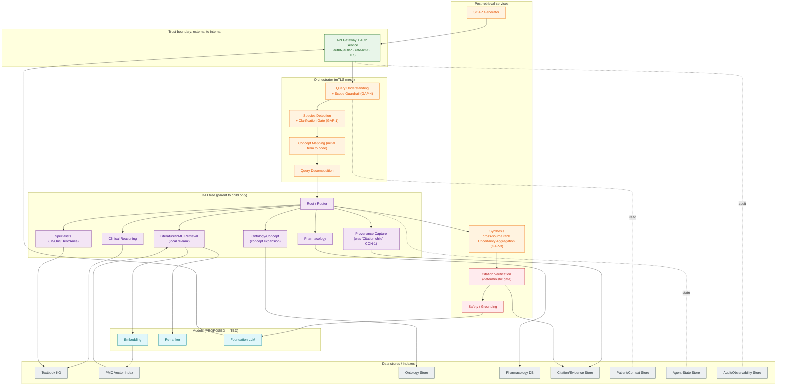
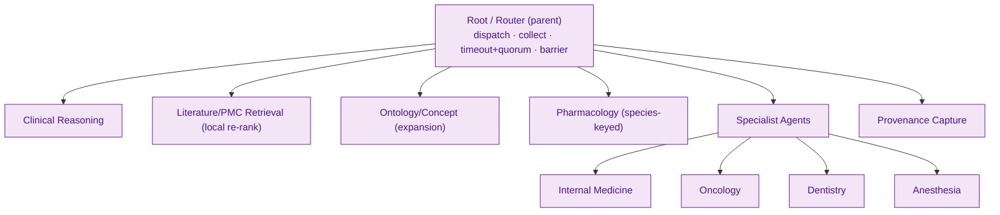
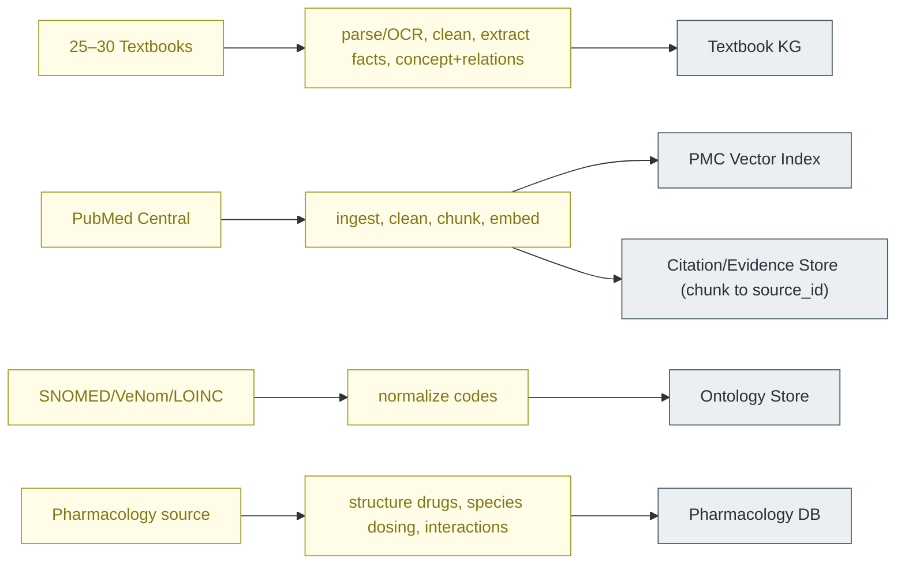
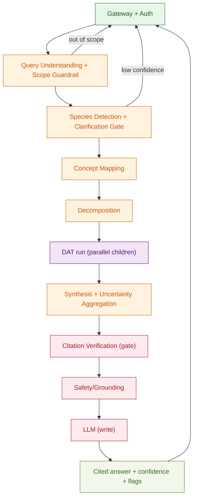
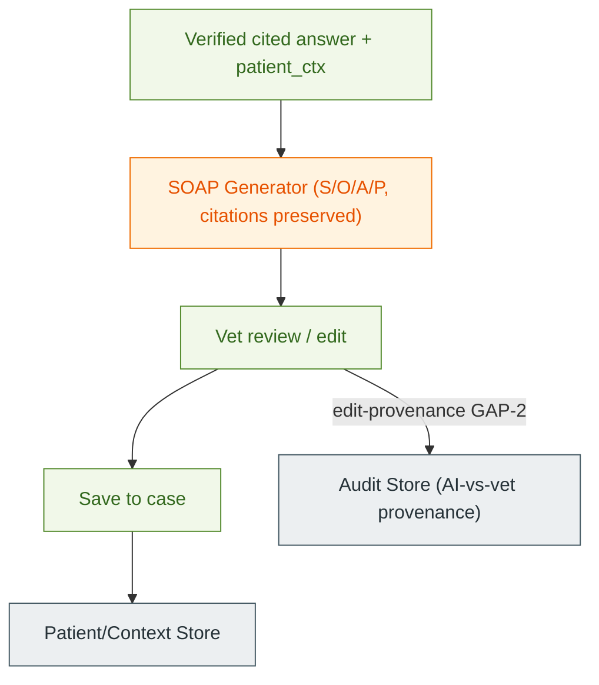
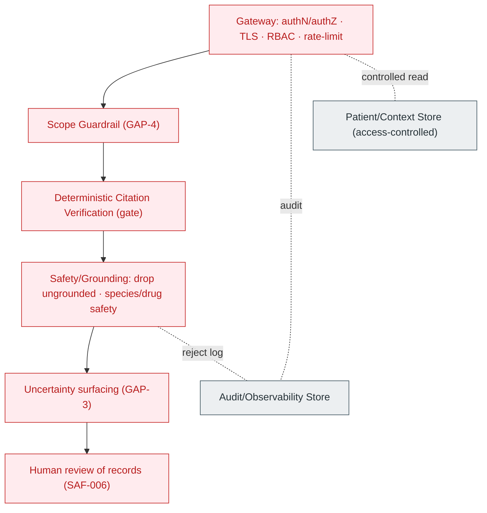
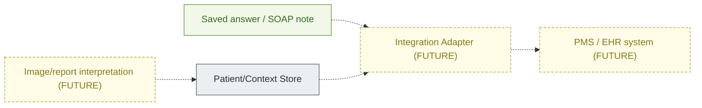

# Veterinary Clinical Intelligence Platform — Architecture Specification

**Document status:** Draft v1.0 · Derived from and consistent with [`PRD.md`](./PRD.md)
**Date:** 2026-09-27
**Owner:** Engineering / Architecture
**Companion documents:** [`PRD.md`](./PRD.md) (product requirements), [`ARCHITECTURE.md`](./ARCHITECTURE.md) (the 5 reference diagrams), [`DIAGRAMS_EXPLAINED.md`](./DIAGRAMS_EXPLAINED.md)

This specification takes the PRD as its input and turns it into an architecture that Engineering, AI/ML, and QA can build against. It does **not** re-state the PRD. It does three things: (1) it **validates** the product requirements against the architecture and lists what is missing or contradictory; (2) it defines **eight architecture views**, each with per-component and per-connection detail; and (3) it labels the maturity of every element as **CONFIRMED**, **PROPOSED**, or **FUTURE**.

---

## Status vocabulary (read this first)

Because this is a design-stage project, "CONFIRMED" does **not** mean "already built and deployed." It means the item is an **established, non-negotiable design decision** in the PRD and reference architecture, and building anything else would contradict the product. The three labels are:

- **CONFIRMED** — an architectural decision the PRD/reference architecture fixes as a requirement. The *shape* is settled (e.g. "there is a deterministic citation-verification gate before generation"). It may still be unbuilt.
- **PROPOSED** — a sensible, specific design choice that is **not yet ratified** — exact API paths, service decomposition, sync/async choices, and any concrete technology or model. Written as **`PROPOSED — TBD`** where a value is genuinely undecided.
- **FUTURE** — explicitly deferred beyond V1 (e.g. PMS/EHR integration, image interpretation).

No production endpoint, model, database engine, or vendor is invented. Where the PRD leaves a decision open, it stays open here (traced to the PRD's open questions OQ-1…OQ-14).

---

## 0 · Requirements ↔ Architecture Validation

This is the part the PRD alone could not give you: a check that the architecture actually covers every requirement, and an honest list of the gaps and contradictions found while doing it.

### 0.1 Traceability matrix (PRD requirement → architecture component / view)

| PRD requirement | Covered by (component · view) | Status |
|---|---|---|
| FR-001 Authenticated access | API Gateway + Auth Service · §1, §7 | CONFIRMED (mechanism `PROPOSED — TBD`) |
| FR-002 Patient/species context capture | Session/Case Service + Patient/Context Store · §1, §5 | CONFIRMED |
| FR-003 Context retention across follow-ups | Session/Case Service + Patient/Context Store · §5 | CONFIRMED |
| FR-004 Species detection (+ confirm on low confidence) | Species Detection · §5 **+ new Clarification path (GAP-1)** | CONFIRMED core; **clarification loop missing** |
| FR-005 Concept mapping to SNOMED/VeNom/LOINC | Concept Mapping + Ontology Store · §5 | CONFIRMED (endpoint PROPOSED) |
| FR-006 Query decomposition | Query Decomposition · §5 | CONFIRMED (endpoint PROPOSED) |
| FR-007 DAT orchestration (parent↔child only) | Root/Router + children · §3 | CONFIRMED |
| FR-008 RAG over PMC | Literature Agent + Embedding + Vector Index + Re-ranker · §3, §5 | CONFIRMED (models/DB TBD) |
| FR-009 Textbook/factual retrieval | Clinical Reasoning + Specialist agents + Textbook KG · §3, §5 | CONFIRMED (KG engine TBD) |
| FR-010 Species-specific pharmacology | Pharmacology Agent + Pharmacology DB · §3, §5 | CONFIRMED (DB/source TBD) |
| FR-011 Specialist agents | Specialist Agents (IM/Onc/Dent/Anes) · §3 | CONFIRMED (which ship in V1 → OQ-9) |
| FR-012 Ranking + synthesis | Re-ranker + Synthesis Service · §5 | CONFIRMED (endpoint PROPOSED) |
| FR-013 Deterministic citation verification | Citation Verification + Citation/Evidence Store · §5, §7 | CONFIRMED (endpoint PROPOSED) |
| FR-014 Grounded generation | Safety/Grounding + Foundation LLM · §5, §7 | CONFIRMED (model TBD) |
| FR-015 Cited answer presentation | Application/UI + Output · §5 | CONFIRMED |
| FR-016 SOAP generation | SOAP Generator · §6 | CONFIRMED (endpoint PROPOSED) |
| FR-017 SOAP review/edit (+ AI-vs-vet audit) | Application/UI + Audit Store · §6 **+ edit-provenance write (GAP-2)** | CONFIRMED core; **edit-provenance path underspecified** |
| FR-018 Save | Session/Case Service + Patient/Context Store · §6 | CONFIRMED |
| FR-019 PMS/EHR export | External Integration · §8 | FUTURE |
| FR-020 Uncertainty/low-evidence handling | **new Uncertainty Aggregation (GAP-3)** · §5, §7 | **missing as a named component** |
| FR-021 Out-of-scope handling | **new Scope/Guardrail classifier (GAP-4)** · §5, §7 | **missing as a named component** |
| FR-022 Auditability | Audit/Observability Store · §7 | CONFIRMED |
| AI-001 Retrieval-grounded only | Safety/Grounding gate + LLM contract · §5, §7 | CONFIRMED |
| AI-002 Claim-level attribution | Citation/Evidence Store (`source_id ↔ span`) · §7 | CONFIRMED |
| AI-003 Species-conditioned reasoning | species propagated on every DAT dispatch · §3 | CONFIRMED |
| AI-004 Confidence reporting to vet | agent `confidence` fields **+ aggregation (GAP-3)** · §5 | partial; **aggregation/display missing** |
| AI-005 No peer-to-peer agents | DAT topology · §3 | CONFIRMED |
| AI-006 Synthesis after retrieval | Root barrier before Synthesis · §3, §5 | CONFIRMED |
| AI-007 Deterministic verification gate | Citation Verification · §5, §7 | CONFIRMED |
| AI-008 Graceful degradation | Root partial-collection policy · §3 **+ needs explicit timeout/quorum rule (GAP-5)** | CONFIRMED intent; **policy undefined** |
| AI-009 Freshness signalling | Citation/Evidence Store carries dates · §4, §7 | CONFIRMED |
| SAF-001…009 Safety guardrails | Security & Trust · §7 | CONFIRMED (see §7) |
| DP-001…008 Data/privacy | Security & Trust + store separation · §7 | CONFIRMED core; **DP-007 retention lifecycle missing (GAP-6)** |
| NFR-001…010 | cross-cutting · all views | CONFIRMED intent; targets `PROPOSED — TBD` |
| UX-001…010 | Application/UI · §5 | CONFIRMED (UI spec out of scope here) |

### 0.2 Gaps found (requirement has no clear home in the current architecture)

- **GAP-1 — Species clarification loop.** FR-004/UX-003 require the system to *ask the vet* when species confidence is low, but the online flow in the reference architecture is one-directional (understand → retrieve → answer). **Resolution (PROPOSED):** add a **Clarification Gate** in the orchestrator that can short-circuit the flow and return a `needs_clarification` response to the UI before any DAT dispatch. Defined in §5.
- **GAP-2 — SOAP edit provenance.** FR-017 requires an audit record distinguishing AI-generated vs vet-edited SOAP content, but no write path captures the edit delta. **Resolution (PROPOSED):** the Application/UI emits an edit-provenance record to the Audit Store on save. Defined in §6.
- **GAP-3 — Uncertainty aggregation & display.** FR-020/AI-004 require surfacing low/conflicting evidence, but confidence values from agents have no defined aggregation point or output field. **Resolution (PROPOSED):** an **Uncertainty Aggregation** step inside Synthesis computes an answer-level confidence + conflict flags, carried through to the Output contract. Defined in §5.
- **GAP-4 — Scope / guardrail classification.** FR-021 requires declining out-of-scope requests, but no component classifies scope. **Resolution (PROPOSED):** a **Scope Guardrail** check inside Query Understanding rejects/redirects before decomposition. Defined in §5, §7.
- **GAP-5 — Degradation policy (timeout/quorum).** AI-008/NFR-004 require graceful degradation, but the Root has no defined rule for how long to wait or how many children must return. **Resolution (PROPOSED):** Root enforces a per-child timeout and a minimum-quorum policy, recorded in Agent State. Defined in §3. *(Exact values `PROPOSED — TBD`.)*
- **GAP-6 — Data retention/residency lifecycle.** DP-007 requires retention/residency handling, but no lifecycle component exists. **Resolution (PROPOSED/FUTURE):** a retention policy applied to Patient/Context and Audit stores; specifics gated on OQ-10 (regulatory scope). Noted in §7.
- **GAP-7 — Image/report handling.** FR-002 accepts an `image_ref` in the request payload, but no component consumes it. **Resolution (FUTURE):** in V1 an image is stored as attached context only (not interpreted); interpretation is FUTURE, gated on OQ-14. Noted in §5, §8.

### 0.3 Contradictions found (architecture is internally inconsistent and must be reconciled)

- **CON-1 — Citation verification appears twice.** The reference architecture shows an **Evidence/Citation Verification *child agent*** dispatched in parallel by Root, *and* a **Citation Verification *governance service*** that runs after Synthesis. These cannot both be the verification-of-record, because the PRD is explicit that **verification happens after synthesis and before generation** (AI-006, AI-007). **Resolution (this spec):** the **deterministic verification-of-record is a post-synthesis gate** (§5/§7), not a parallel child. A child agent may still perform *retrieval-time provenance capture* (writing `source_id ↔ span` to the Citation/Evidence Store), but it does not decide claim validity. This spec renames the child's role to **Provenance Capture** to remove the ambiguity, and keeps a single authoritative verification gate.
- **CON-2 — Ontology mapping appears twice.** Concept Mapping in the orchestrator maps terms to codes, *and* an Ontology/Concept child agent also touches the ontology store. **Resolution (this spec):** the **orchestrator's Concept Mapping** performs the initial term→code mapping (needed before decomposition); the **DAT Ontology/Concept agent** performs *concept expansion* (synonyms, child concepts, related codes) during retrieval. Distinct responsibilities, one store. Clarified in §3, §5.
- **CON-3 — Where does re-ranking live?** The reference architecture shows re-ranking both inside the Literature agent and again in the Synthesis step. **Resolution (this spec):** the **Literature agent re-ranks its own retrieved passages** (local relevance); **Synthesis performs cross-source ranking** across all agents' evidence. Two different jobs; both retained, clearly scoped. Clarified in §3, §5.

None of these contradictions is fatal — they are naming/placement ambiguities in the reference diagrams. This spec resolves each one in a way that stays faithful to the PRD's hard rules (parent↔child only; retrieve → synthesize → verify → generate).

---

## 1 · High-Level Architecture

The layered system, matching PRD §26-A. Each layer is a bounded responsibility; the primary runtime flow moves left-to-right (online query), and ingestion feeds the stores from the side (offline).

```mermaid
flowchart LR
  classDef user fill:#E3F2FD,stroke:#1565C0,color:#0D47A1;
  classDef api fill:#E8F5E9,stroke:#2E7D32,color:#1B5E20;
  classDef orch fill:#FFF3E0,stroke:#EF6C00,color:#E65100;
  classDef dat fill:#F3E5F5,stroke:#6A1B9A,color:#4A148C;
  classDef know fill:#FCE4EC,stroke:#AD1457,color:#880E4F;
  classDef model fill:#E0F7FA,stroke:#00838F,color:#006064;
  classDef safety fill:#FFEBEE,stroke:#C62828,color:#B71C1C;
  classDef out fill:#F1F8E9,stroke:#558B2F,color:#33691E;
  classDef future fill:#FFFDE7,stroke:#9E9D24,color:#827717,stroke-dasharray:4 3;

  VET["1 · Veterinarian<br/>question · species · context"]:::user
  APP["2 · Application + API Gateway (CONFIRMED)<br/>auth · session · scope guardrail"]:::api
  ORCH["3 · Clinical Intelligence Orchestrator (CONFIRMED)<br/>understand · species · concept-map · decompose · clarify"]:::orch
  DAT["4 · DAT Orchestrator (CONFIRMED)<br/>Root/Router to parallel children back to Root"]:::dat
  KNOW["5 · Knowledge & Retrieval (CONFIRMED)<br/>Textbook KG · PMC index · Ontology · Pharmacology"]:::know
  MODEL["6 · Model Layer (PROPOSED — TBD)<br/>Embedding · Re-ranker · LLM"]:::model
  SAFE["7 · Safety & Citation (CONFIRMED)<br/>verify then ground then uncertainty"]:::safety
  OUT["8 · Clinical Output (CONFIRMED)<br/>cited answer + confidence"]:::out
  SOAP["9 · SOAP (CONFIRMED)"]:::out
  EXT["10 · PMS/EHR Integration (FUTURE)"]:::future

  VET --> APP --> ORCH --> DAT
  DAT --> KNOW
  DAT --> MODEL
  KNOW --> SAFE
  SAFE --> MODEL
  MODEL --> OUT --> SOAP -.-> EXT
```

**Layer components:**

| Layer | Responsibility | Input | Output | Dependency | Data store | Model | API / interface | Failure behaviour | Status |
|---|---|---|---|---|---|---|---|---|---|
| Application + API Gateway | Single secured door; authN/authZ; session; scope guardrail | vet request (HTTPS/JSON) | routed internal request; final response | Auth service | Patient/Context (read), Audit (write) | — | `POST /api/v1/clinical/query` | Reject unauth; 4xx/5xx; no bypass | CONFIRMED (auth mechanism `PROPOSED — TBD`; endpoint PROPOSED) |
| Clinical Intelligence Orchestrator | Understand, detect species, map concepts, decompose, clarify | internal query | subqueries + concepts + species + patient_ctx | Ontology Store | Patient/Context (read) | — | internal (mTLS) | Return `needs_clarification`; degrade | CONFIRMED |
| DAT Orchestrator | Fan-out to children in parallel; collect; barrier before synthesis | routed subqueries | collected structured evidence | children, Agent-State | Agent-State (r/w) | — | `POST /api/v1/agents/route` | Timeout+quorum, partial result flagged | CONFIRMED (endpoint PROPOSED) |
| Knowledge & Retrieval | Serve facts, passages, codes, drug data | scoped subqueries | evidence + `source_ids` | stores below | KG, Vector Index, Ontology, Pharmacology, Citation | Embedding, Re-ranker | `POST /api/v1/retrieval/search`, lookups | Return fewer/none + flag | CONFIRMED (engines/models TBD) |
| Model Layer | Embed, re-rank, generate | text / passages / grounded context | vectors / ranked / draft answer | — | — | Embedding, Re-ranker, LLM | `embed_query()`, `invoke_llm()` | Retry/fallback; honest reduced answer | PROPOSED — TBD |
| Safety & Citation | Verify claims, ground, aggregate uncertainty | candidate answer + claim-source map | approved citations + grounded context + confidence | Citation Store | Citation/Evidence | — | `POST /api/v1/citations/verify` | Block unverified; drop ungrounded | CONFIRMED (endpoint PROPOSED) |
| Clinical Output | Present cited answer + confidence | grounded answer | `{answer, citations[], confidence, flags[]}` | — | — | — | gateway response | Show partial + reason | CONFIRMED |
| SOAP | Turn cited answer into editable note | answer + context + citations | `{soap:{S,O,A,P}, citations[]}` | LLM (optional) | Patient/Context (write on save) | LLM (optional) | `POST /api/v1/soap/generate` | Vet writes manually | CONFIRMED (endpoint PROPOSED) |
| PMS/EHR Integration | Export saved note to clinic system | saved note | external write | external system | — | — | external API | Out of scope V1 | FUTURE |

**Key connections (High-Level):**

- **Veterinarian → Application/Gateway** · DATA: `{vet_id, patient, species?, text, image_ref?}` · PROTOCOL/API: `POST /api/v1/clinical/query` (HTTPS/JSON) `[PROPOSED]` · PURPOSE: submit an authenticated clinical query · RESPONSE: `{answer, citations[], confidence, flags[], soap?}` or `{needs_clarification}`.
- **Application → Orchestrator** · DATA: `{query_id, text, image_ref, patient_ctx}` · PROTOCOL/API: internal gRPC/HTTP over mTLS `[PROPOSED]` · PURPOSE: hand a validated, in-scope request inward · RESPONSE: `{subqueries[], concepts[], species}`.
- **Orchestrator → DAT** · DATA: `{subqueries[], concepts[], species, patient_ctx}` · PROTOCOL/API: `POST /api/v1/agents/route` `[PROPOSED]` · PURPOSE: begin coordinated retrieval · RESPONSE: `{run_id}` then collected evidence.
- **DAT → Knowledge & Retrieval** · DATA: scoped subquery + concepts + species · PROTOCOL/API: retrieval/lookups (see §5) · PURPOSE: fetch real evidence · RESPONSE: evidence + `source_ids` + scores.
- **Safety & Citation → Model Layer** · DATA: grounded context + approved citations · PROTOCOL/API: `invoke_llm()` `[PROPOSED]` · PURPOSE: write the answer over verified context only · RESPONSE: draft cited answer.
- **Output → SOAP → PMS/EHR** · DATA: cited answer → SOAP note → external record · PURPOSE: documentation, then (FUTURE) export.

---

## 2 · Low-Level Architecture

This view names the concrete services and stores and how they wire together. It is consistent with — and where it resolves ambiguity, supersedes — the reference diagrams in [`ARCHITECTURE.md` §2/§2a](./ARCHITECTURE.md) (see CON-1/2/3). Every technology remains `PROPOSED — TBD` where the PRD has not chosen one.

**Services & stores — component detail:**

| Component | Responsibility | Input | Output | Dependency | Data store | Model | API / interface | Failure behaviour | Status |
|---|---|---|---|---|---|---|---|---|---|
| API Gateway + Auth | Verify identity/role; TLS; rate-limit; route | HTTPS request | internal request / final response | Auth service | PCS (read), AOS (write) | — | `POST /api/v1/clinical/query`, `/soap/generate` | 401/403/429; log; no bypass | CONFIRMED (mechanism TBD) |
| Query Understanding + Scope Guardrail | Extract intent/entities; **reject out-of-scope (GAP-4)** | `{query_id, text, patient_ctx}` | `{intent, entities[]}` or `{out_of_scope}` | — | PCS (read) | (classifier `PROPOSED — TBD`) | internal | Redirect out-of-scope; degrade | CONFIRMED core; guardrail PROPOSED |
| Species Detection + Clarification Gate | Determine species w/ confidence; **ask vet if low (GAP-1)** | intent + entities + context | `{species, confidence}` or `{needs_clarification}` | — | — | (detector `PROPOSED — TBD`) | internal | On low confidence, return clarification | CONFIRMED core; gate PROPOSED |
| Concept Mapping | Initial term→code (SNOMED/VeNom/LOINC) | `{terms[], species}` | `{snomed[], venom[], loinc[]}` | Ontology Store | ONTS (read) | — | `POST /api/v1/ontology/map` | Flag unmapped terms | CONFIRMED (endpoint PROPOSED) |
| Query Decomposition | Split into scoped subqueries | understood query | `{subqueries[]}` | — | — | — | internal | Fall back to single subquery | CONFIRMED |
| Root/Router | Fan-out; collect; timeout+quorum (GAP-5); barrier | `{subqueries[], concepts[], species}` | collected evidence | children | ASE (r/w) | — | `POST /api/v1/agents/route` | Partial result if quorum met; else error | CONFIRMED (policy PROPOSED) |
| Clinical Reasoning | Differentials over textbook facts | scoped subquery | `{evidence[], source_ids[], confidence}` | KG | KG (read) | — | internal | Reduced coverage flagged | CONFIRMED (KG engine TBD) |
| Literature/PMC Retrieval | Embed → top-k → **local re-rank (CON-3)** | scoped subquery | `{passages[], doc_ids[], scores[], confidence}` | Embedding, Vector Index, Re-ranker | VIDX (read) | Embedding, Re-ranker | `POST /api/v1/retrieval/search` | Fewer results/flag gap | CONFIRMED (models/DB TBD) |
| Ontology/Concept | **Concept expansion (CON-2)** — synonyms, related codes | `{concepts[], species}` | `{expanded_codes[], concept_ids[]}` | Ontology Store | ONTS (read) | — | code lookup | Return base concepts only | CONFIRMED |
| Pharmacology | Drug info keyed by drug + species | `{drug, species}` | `{dose_by_species, side_effects[], interactions[], source_ids[]}` | Pharmacology DB | PHDB (read) | — | SQL/REST lookup | Return "no species data" — never substitute | CONFIRMED (DB/source TBD) |
| Specialists (IM/Onc/Dent/Anes) | Domain analysis over textbook facts | scoped subquery + species | `{specialist_findings[], source_ids[], confidence}` | KG | KG (read) | — | internal | Skip domain, flag | CONFIRMED (V1 set → OQ-9) |
| Provenance Capture (was Citation child) | Record `source_id ↔ span/DOI/passage` for retrieved evidence | retrieved passages | provenance rows | Citation Store | CES (write) | — | internal | Retry write; alert | CONFIRMED (role clarified, CON-1) |
| Synthesis + Uncertainty Aggregation | Cross-source rank; combine to candidate answer + claim-source map; **compute answer confidence + conflict flags (GAP-3)** | all evidence | `{candidate_answer, claim_source_map, confidence, conflicts[]}` | Re-ranker (optional) | — | Re-ranker (optional) | `POST /api/v1/synthesis` | Partial synthesis, flagged | CONFIRMED (endpoint PROPOSED) |
| Citation Verification (gate) | Deterministic claim↔source match; drop/flag unverified | `{claims[], claim_source_map}` | `{verified[], unverified[], citations[]}` | Citation Store | CES (read) | — | `POST /api/v1/citations/verify` | Block unverified from generation | CONFIRMED (endpoint PROPOSED) |
| Safety / Grounding | Remove ungrounded claims; enforce species/drug safety | verified claims | `{grounded_context, approved_citations[], rejects[]}` | — | — | — | internal | Reject rather than pass | CONFIRMED |
| Foundation LLM | Write answer over grounded context only | `{grounded_context, approved_citations[], prompt}` | `{draft_answer}` | — | — | LLM | `invoke_llm()` | Honest reduced answer | PROPOSED — TBD |
| SOAP Generator | Cited answer → editable SOAP | `{answer, patient_ctx, citations[]}` | `{soap:{S,O,A,P}, citations[]}` | LLM (optional) | PCS (write on save) | LLM (optional) | `POST /api/v1/soap/generate` | Vet writes manually | CONFIRMED (endpoint PROPOSED) |

**Connection register (Low-Level) — `SOURCE → DEST · DATA → PROTOCOL/API → PURPOSE → RESPONSE`:**

1. `Gateway → Query Understanding` · `{query_id, text, patient_ctx}` → internal gRPC/HTTP (mTLS) `[PROPOSED]` → understand & scope-check → `{intent, entities[]}` | `{out_of_scope}`.
2. `Query Understanding → Species Detection` · `{intent, entities[]}` → internal → determine species → `{species, confidence}` | `{needs_clarification}`.
3. `Species Detection → Concept Mapping` · `{terms[], species}` → internal → map words to codes → `{snomed[], venom[], loinc[]}`.
4. `Concept Mapping → Ontology Store` · `{terms[], species}` → `POST /api/v1/ontology/map` `[PROPOSED]` → code lookup → `{codes[]}`.
5. `Concept Mapping → Query Decomposition` · understood query → internal → split into subqueries → `{subqueries[]}`.
6. `Decomposition → Root/Router` · `{subqueries[], concepts[], species, patient_ctx}` → `POST /api/v1/agents/route` `[PROPOSED]` → start DAT run → `{run_id}`.
7. `Root → each child` · `{subquery, concepts[], species}` → async dispatch (queue/RPC) `[PROPOSED]` → parallel retrieval → (async task, no direct return).
8. `Literature → Embedding` · `{text}` → `embed_query()` `[PROPOSED]` → vectorize subquery → `{vector[]}`.
9. `Literature → Vector Index` · `{query_vector, k, filters}` → `POST /api/v1/retrieval/search` `[PROPOSED]` → ANN top-k → `{passages[], doc_ids[], scores[]}`.
10. `Literature → Re-ranker` · `{query, passages[]}` → `rerank_evidence()` `[PROPOSED]` → local relevance re-rank (CON-3) → `{ranked[], scores[]}`.
11. `Clinical Reasoning / Specialist → Textbook KG` · `{concepts[], relations[]}` → graph/factual query `[PROPOSED]` → fetch established facts → `{facts[], node_ids[]}`.
12. `Ontology/Concept → Ontology Store` · `{concepts[], species}` → code lookup → concept expansion (CON-2) → `{expanded_codes[]}`.
13. `Pharmacology → Pharmacology DB` · `{drug, species}` → SQL/REST `[PROPOSED]` → species dosing lookup → `{dose_by_species, interactions[], source_ids[]}` | `{no_data}`.
14. `Provenance Capture → Citation/Evidence Store` · `{source_id, span, doc_id, uri}` → internal write → record provenance → `ack`.
15. `each child → Root` · `{evidence[], source_ids[], confidence, metadata}` → structured return (async→collected) → report findings → collected into run.
16. `Root → Synthesis` · `{ranked_evidence[], findings[], source_ids[]}` → `POST /api/v1/synthesis` `[PROPOSED]` → cross-source rank + combine + uncertainty (GAP-3) → `{candidate_answer, claim_source_map, confidence, conflicts[]}`.
17. `Synthesis → Citation Verification` · `{claims[], claim_source_map}` → `POST /api/v1/citations/verify` `[PROPOSED]` → deterministic span↔claim match → `{verified[], unverified[], citations[]}`.
18. `Citation Verification → Citation/Evidence Store` · `{source_ids[]}` → read spans/DOIs → confirm support → `{spans[], dates[]}`.
19. `Citation Verification → Safety/Grounding` · `{verified_claims[], citations[]}` → internal → drop ungrounded + species/drug safety → `{grounded_context, approved_citations[], rejects[]}`.
20. `Safety/Grounding → Foundation LLM` · `{grounded_context, approved_citations[], prompt}` → `invoke_llm()` `[PROPOSED]` → write over verified context only → `{draft_answer}`.
21. `LLM → Gateway → Vet` · `{answer, citations[], confidence, flags[]}` → internal→external (query response) → deliver cited answer → `200 OK`.
22. `Root ↔ Agent-State Store` · `{run_id, node, status}` → r/w → track DAT run + timeout/quorum (GAP-5) → `{state}`.
23. `Gateway/Root → Audit/Observability Store` · `{trace_id, spans[], event}` → emit (OTLP/JSON) → audit & debug → `ack`.

---

## 3 · DAT Agent Architecture

The orchestration core. This view fixes the contradictions (CON-1/2/3) and adds the missing degradation policy (GAP-5). It stays faithful to the PRD's contract: **one Root parent; children in parallel; parent↔child only; synthesis after retrieval; verification before generation.**

**Routing / child-selection contract (CONFIRMED contract; mechanism `PROPOSED — TBD`):**
Before dispatching, the Root decides *which* children to run for this query. The **contract is fixed**:
- **Selection input:** the mapped clinical concepts (`{snomed[], venom[], loinc[]}`) plus the labelled subqueries from decomposition (e.g. `etiology`, `diagnostics`, `staging`, `therapeutics`).
- **Selection output:** the set of child agents to invoke for this run — always including the retrieval children relevant to the subquery labels, the Pharmacology agent **only when** a therapeutics/drug subquery or a drug concept is present, and each Specialist agent **only when** its domain matches the concepts/subqueries. Provenance Capture always runs for any retrieval.
- **Determinism of the contract:** given the same concepts + subquery labels, the *set of eligible* children is stable and testable ("which agents fire for query X" is a fixed function of the inputs).
- **Mechanism (`PROPOSED — TBD`, decision D-1):** whether selection is implemented as explicit rules (concept/label → agent map) or a learned router is undecided; the *contract above* does not change with that choice.

**Communication contract (CONFIRMED):**
- **Parent → child:** Root dispatches `{subquery, concepts[], species}` to each **selected** child **in parallel (async)**.
- **Child → parent:** each child returns `{evidence[], source_ids[], confidence, metadata}`. **Children never talk to each other.**
- **Barrier:** Synthesis begins only after all dispatched children return **or** the timeout/quorum policy fires.
- **Degradation policy (PROPOSED — GAP-5):** per-child timeout `T` and minimum quorum `Q` of children required to proceed; results below `Q` return a flagged partial answer or a graceful error; unmet children are recorded in Agent-State and surfaced as `flags[]`. *(Values `PROPOSED — TBD`.)*

**Node detail:**

| Node | Responsibility | Input | Output | Dependency | Data store | Model | API/interface | Failure behaviour | Status |
|---|---|---|---|---|---|---|---|---|---|
| Root/Router | Fan-out, collect, enforce timeout+quorum, trigger synthesis | routed subqueries | orchestrated evidence set | children, Synthesis | Agent-State (r/w) | — | `POST /api/v1/agents/route` | Partial (≥Q) flagged; else error | CONFIRMED (policy PROPOSED) |
| Clinical Reasoning | Differentials from established facts | subquery+species | `{evidence[], source_ids[], confidence}` | Textbook KG | KG (read) | — | internal | Reduced coverage, flagged | CONFIRMED |
| Literature/PMC Retrieval | Semantic retrieval + local re-rank | subquery | `{passages[], doc_ids[], scores[], confidence}` | Embedding, Vector Index, Re-ranker | VIDX (read) | Embedding, Re-ranker | `retrieve_top_k()` | Fewer/none + flag | CONFIRMED (models/DB TBD) |
| Ontology/Concept | Concept expansion | concepts+species | `{expanded_codes[], concept_ids[]}` | Ontology Store | ONTS (read) | — | code lookup | Base concepts only | CONFIRMED |
| Pharmacology | Species-specific drug data | drug+species | `{dosing, interactions[], source_ids[]}` | Pharmacology DB | PHDB (read) | — | SQL/REST | "No data" not substitute | CONFIRMED (DB/source TBD) |
| Specialist(s) | Domain findings | subquery+species | `{specialist_findings[], source_ids[], confidence}` | Textbook KG | KG (read) | — | internal | Skip+flag | CONFIRMED (V1 set → OQ-9) |
| Provenance Capture | Write `source_id ↔ span` | retrieved evidence | provenance rows | Citation Store | CES (write) | — | internal | Retry+alert | CONFIRMED (CON-1) |

**Connections (DAT):**
- `Root → child` · `{subquery, concepts[], species}` → async dispatch (queue/RPC) `[PROPOSED]` → assign scoped work → (async).
- `child → Root` · `{evidence[], source_ids[], confidence, metadata}` → structured return → report findings → collected.
- `Root ↔ Agent-State` · `{run_id, node, status}` → r/w → run tracking + degradation policy → `{state}`.
- *(No child↔child edges exist — this absence is itself a CONFIRMED requirement, AI-005.)*

---

## 4 · Offline Knowledge Ingestion Architecture

Runs **before** any query (PRD §12, §26-D, flow A). It is the only writer to the knowledge stores; the online path only reads them. This separation is CONFIRMED; the tools/engines are `PROPOSED — TBD`.

**Component detail:**

| Component | Responsibility | Input | Output | Dependency | Data store | Model | API/interface | Failure behaviour | Status |
|---|---|---|---|---|---|---|---|---|---|
| Textbook pipeline | Parse/OCR, clean, extract facts & relations | textbook files | concept+relationship graph | — | KG (write) | (OCR/extractor `PROPOSED — TBD`) | batch job | Quarantine bad doc; log; re-run | CONFIRMED (tools TBD) |
| PMC pipeline | Ingest, clean, chunk, embed | PMC documents | vectors + doc_ids; chunk→source_id | Embedding model | VIDX (write), CES (write) | Embedding | batch job | Skip/retry doc; log | CONFIRMED (model/DB TBD) |
| Ontology load | Normalize & load standard codes | SNOMED/VeNom/LOINC releases | normalized code sets | — | ONTS (write) | — | batch job | Reject malformed; version pin | CONFIRMED |
| Pharmacology load | Structure drug/species/dose/interaction data | pharmacology source | structured drug records | — | PHDB (write) | — | batch job | Reject incomplete record | CONFIRMED (source TBD) |
| Ingestion orchestration/versioning | Schedule runs; version corpora; record freshness dates | source releases | versioned, dated store contents | pipelines | AOS (write) | — | batch/scheduler `PROPOSED — TBD` | Alert on failed run; keep prior version | PROPOSED |

**Connections (Ingestion) — all offline/batch:**
- `Textbooks → Textbook pipeline → Textbook KG` · files → batch → build factual graph → written graph.
- `PMC → PMC pipeline → Vector Index` · docs → batch (chunk+embed) → build searchable index → vectors+doc_ids.
- `PMC pipeline → Citation/Evidence Store` · `{chunk, source_id, doc_id, uri, date}` → batch write → enable provenance & freshness (AI-009) → `ack`.
- `SNOMED/VeNom/LOINC → Ontology load → Ontology Store` · code releases → batch → normalized codes → written.
- `Pharmacology source → Pharmacology load → Pharmacology DB` · drug data → batch → structured drug records → written.

**Consistency note:** the online path (§5) must never write these stores, and must treat "not in the store" as an honest gap (SAF-008), not a prompt to the LLM to fill from memory (AI-001).

---

## 5 · Online Query Architecture

The live request path (PRD §8, §26-A, flow B). This view integrates the new Clarification Gate (GAP-1), Scope Guardrail (GAP-4), and Uncertainty Aggregation (GAP-3), and enforces the resolved ordering: **understand → (clarify?) → retrieve → synthesize → verify → ground → generate.**

**Behavioural rules (CONFIRMED unless noted):**
- **Scope guardrail (PROPOSED, GAP-4):** out-of-scope requests return early from Query Understanding; no DAT run starts.
- **Clarification gate (PROPOSED, GAP-1):** if species confidence < threshold, return `{needs_clarification}` to the UI before decomposition. *(Threshold `PROPOSED — TBD`.)*
- **Barrier + degradation (GAP-5):** Synthesis waits for the DAT barrier; partial results are flagged.
- **Verification precedes generation (CONFIRMED, AI-006/007):** the LLM is never called with unverified/ungrounded content.
- **Uncertainty (PROPOSED, GAP-3):** answer-level confidence and conflict flags are computed in Synthesis and returned in the response contract.

**Component detail:** as defined in §2 (Low-Level). The online view reuses those services; it adds no new stores.

**Connections (Online) — `SOURCE → DEST · DATA → PROTOCOL/API → PURPOSE → RESPONSE`:**
1. `Vet → Gateway` · `{vet_id, patient, species?, text, image_ref?}` → `POST /api/v1/clinical/query` (HTTPS) `[PROPOSED]` → submit query → `{answer, citations[], confidence, flags[]}` | `{needs_clarification}` | `{out_of_scope}`.
2. `Gateway → Query Understanding` · `{query_id, text, patient_ctx}` → mTLS internal → understand + scope-check → `{intent, entities[]}` | early-return.
3. `Query Understanding → Patient/Context Store` · `{patient_id}` → read → load case context (FR-003) → `{patient_ctx}`.
4. `Species Detection → Gateway` (conditional) · `{needs_clarification, options[]}` → response → ask the vet to confirm species (GAP-1) → vet re-submits.
5. `Concept Mapping → Ontology Store` · `{terms[], species}` → `POST /api/v1/ontology/map` `[PROPOSED]` → term→code → `{codes[]}`.
6. `Decomposition → Root` · `{subqueries[], concepts[], species, patient_ctx}` → `POST /api/v1/agents/route` `[PROPOSED]` → begin retrieval → `{run_id}`.
7. `DAT children → stores` · scoped queries → retrieval/lookup (see §3) → gather evidence → evidence + `source_ids`.
8. `Root → Synthesis` · collected evidence → `POST /api/v1/synthesis` `[PROPOSED]` → rank+combine+uncertainty → `{candidate_answer, claim_source_map, confidence, conflicts[]}`.
9. `Synthesis → Citation Verification` · `{claims[], claim_source_map}` → `POST /api/v1/citations/verify` `[PROPOSED]` → deterministic verify → `{verified[], unverified[], citations[]}`.
10. `Citation Verification → Safety/Grounding` · `{verified_claims[], citations[]}` → internal → ground + species/drug safety → `{grounded_context, approved_citations[]}`.
11. `Safety/Grounding → LLM` · `{grounded_context, approved_citations[], prompt}` → `invoke_llm()` `[PROPOSED]` → write cited answer → `{draft_answer}`.
12. `LLM → Gateway → Vet` · `{answer, citations[], confidence, flags[]}` → response → deliver → `200 OK`.

---

## 6 · SOAP Generation Architecture

Opt-in, post-answer (PRD §14). It draws only on the already-verified answer + context — never a fresh ungrounded generation — and requires vet review before save. Adds the edit-provenance path (GAP-2).

**Component detail:**

| Component | Responsibility | Input | Output | Dependency | Data store | Model | API/interface | Failure behaviour | Status |
|---|---|---|---|---|---|---|---|---|---|
| SOAP Generator | Map verified answer to S/O/A/P; preserve citations | `{answer, patient_ctx, citations[]}` | `{soap:{S,O,A,P}, citations[]}` | (LLM optional) | — | LLM (optional) | `POST /api/v1/soap/generate` | Vet writes manually | CONFIRMED (endpoint PROPOSED) |
| Review/Edit (UI) | Let vet edit each section; show citations | draft SOAP | vet-approved SOAP + edit delta | — | — | — | UI action | Block save until reviewed (SAF-006) | CONFIRMED |
| Save | Persist final note to case | approved SOAP | stored note | Session/Case Service | PCS (write) | — | internal | Retry; do not lose edits | CONFIRMED |
| Edit-provenance writer (GAP-2) | Record AI-generated vs vet-edited content | edit delta | audit record | — | AOS (write) | — | internal | Alert on logging failure | PROPOSED |

**Connections (SOAP):**
- `Verified answer → SOAP Generator` · `{answer, patient_ctx, citations[]}` → `POST /api/v1/soap/generate` `[PROPOSED]` → build structured note → `{soap, citations[]}`.
- `SOAP Generator → UI` · `{soap, citations[]}` → response → present for review → vet edits.
- `UI → Save → Patient/Context Store` · `{approved_soap}` → internal write → persist to case → `ack`.
- `UI → Audit Store` · `{ai_content, vet_edits, timestamps}` → internal write → record edit provenance (FR-017, GAP-2) → `ack`.
- `Save → PMS/EHR` · saved note → external API → export → **FUTURE** (§8).

---

## 7 · Security & Trust Architecture

Where the platform earns clinical trust (PRD §16, §17). Two intertwined concerns: **security** (who gets in, how data is protected) and **clinical trust** (nothing unsupported reaches the vet). Both are CONFIRMED as requirements; exact mechanisms are `PROPOSED — TBD`.

**Control detail:**

| Control | Responsibility | Input | Output | Dependency | Data store | Model | API/interface | Failure behaviour | Status |
|---|---|---|---|---|---|---|---|---|---|
| AuthN/AuthZ (Gateway) | Verify identity + role; enforce least privilege | credentials/token | allow/deny + role | Auth service | AOS (write) | — | OIDC/JWT + RBAC `[PROPOSED]` | Deny by default | CONFIRMED (SAF/DP; mechanism TBD) |
| Transport security | Encrypt external (TLS) + internal (mTLS) | traffic | encrypted channel | — | — | — | TLS 1.2+ `[PROPOSED]` | Refuse insecure connection | CONFIRMED (DP-001) |
| Scope Guardrail (GAP-4) | Reject out-of-scope/non-clinical | request text | allow / redirect | — | AOS (write) | classifier `PROPOSED — TBD` | internal | Redirect, never fabricate | PROPOSED (FR-021) |
| Citation Verification gate | Deterministic claim↔source match | claims + map | verified/unverified | Citation Store | CES (read) | — | `/citations/verify` `[PROPOSED]` | Block unverified (SAF-001) | CONFIRMED (AI-007) |
| Safety/Grounding | Drop ungrounded; enforce species/drug safety (SAF-002) | verified claims | grounded context | — | — | — | internal | Reject rather than pass | CONFIRMED |
| Uncertainty surfacing (GAP-3) | Expose low/conflicting evidence to vet | confidence + conflicts | flags in response | — | — | — | response contract | Default to caution | PROPOSED (FR-020/AI-004) |
| Human review of records | Require vet approval before save | draft note | approved note | UI | — | — | UI action | No save without review | CONFIRMED (SAF-006) |
| Audit/Observability | Log inputs, retrieval, verify outcomes, output, edits | all events | traces/logs/metrics | — | AOS (write) | — | OTLP/JSON `[PROPOSED]` | Alert on logging failure | CONFIRMED (FR-022/SAF-007) |
| Store access control & separation | Keep corpora, patient data, state, audit separate & controlled | access requests | permitted access | — | all stores | — | per-store policy | Deny cross-scope access | CONFIRMED (DP-003/004) |
| Retention/residency lifecycle (GAP-6) | Apply retention + residency to patient/audit data | stored data | compliant lifecycle | policy | PCS, AOS | — | `PROPOSED — TBD` | — | PROPOSED/FUTURE (DP-007, OQ-10) |

**Connections (Security & Trust):**
- `External client → Gateway` · credentials + request · TLS + OIDC/JWT `[PROPOSED]` · authenticate/authorize · allow+role | 401/403/429.
- `Gateway → Audit Store` · `{trace_id, actor, action}` · emit `[PROPOSED]` · access logging (FR-022) · `ack`.
- `Synthesis → Citation Verification → Safety/Grounding → LLM` · claims → grounded context · internal · enforce "verified before generated" (AI-006/007) · approved citations only.
- `Safety/Grounding → Audit Store` · `{rejected_claims[]}` · emit · record what was blocked (SAF-001) · `ack`.
- `Any service → Patient/Context Store` · access request · controlled read (RBAC) · protect patient data (DP-003) · permitted fields only.

---

## 8 · External Integration Architecture

All external integration beyond the platform's own boundary. In V1 this is essentially empty by design; it is documented so the boundary is explicit and the FUTURE work is scoped.

**Component detail:**

| Component | Responsibility | Input | Output | Dependency | Data store | Model | API/interface | Failure behaviour | Status |
|---|---|---|---|---|---|---|---|---|---|
| Integration Adapter | Map internal note → external record format; handle auth to clinic system | saved note + patient_ctx | external write request | external system, mapping spec | PCS (read) | — | external API `PROPOSED — TBD` | Queue + retry; never lose local note | FUTURE (FR-019, OQ-10) |
| PMS/EHR system | External system of record | mapped note | stored external record | — | external | — | vendor API | Out of platform control | FUTURE |
| Image/report interpretation | Interpret uploaded image/report (beyond attachment) | `image_ref` | structured findings | model | PCS (read/write) | model `PROPOSED — TBD` | internal | V1: attach-only, no interpretation | FUTURE (FR-002/GAP-7, OQ-14) |

**Connections (External — all FUTURE):**
- `Saved note → Integration Adapter` · `{soap, citations[], patient_ctx}` · internal · prepare for export · mapped record.
- `Integration Adapter → PMS/EHR` · mapped record · vendor API `PROPOSED — TBD` · write to system of record · `ack`/error.
- `Image/report → Patient/Context Store` · `{image_ref}` · internal · **V1: store as attached context only**; interpretation FUTURE · stored reference.

**V1 boundary statement (CONFIRMED):** the platform does **not** call any external clinical system in V1, and does **not** interpret images. The request payload accepts `image_ref` so the contract is forward-compatible, but the image is stored as context, not analysed (resolves GAP-7 for V1).

---

## Status register (roll-up)

| Element | Status | Reference |
|---|---|---|
| Layered architecture; store separation; RAG-grounding; LLM-as-writer | CONFIRMED | §1, PRD §9/§11 |
| DAT topology + parent↔child-only contract + synthesis-after-retrieval | CONFIRMED | §3, PRD §13 |
| Deterministic citation verification gate before generation | CONFIRMED | §5/§7, PRD §16 |
| Species-conditioned reasoning + species/drug safety | CONFIRMED | §3/§7, PRD §11/§16 |
| Offline/online separation | CONFIRMED | §4/§5, PRD §12 |
| SOAP generation (opt-in, reviewed) | CONFIRMED | §6, PRD §14 |
| Auditability + access control + store separation | CONFIRMED | §7, PRD §16/§17 |
| All API endpoints (`/clinical/query`, `/agents/route`, `/synthesis`, `/citations/verify`, `/soap/generate`, `/ontology/map`, `/retrieval/search`) | PROPOSED | throughout, PRD OQ-8 |
| Foundation LLM, Embedding, Re-ranker models | PROPOSED — TBD | §2/§5, PRD OQ-1/OQ-2 |
| Vector DB, Textbook KG engine, Pharmacology DB engine, orchestration runtime, cloud | PROPOSED — TBD | §2/§4, PRD OQ-3…OQ-7 |
| Auth mechanism, TLS/mTLS specifics, retention/residency | PROPOSED — TBD | §7, PRD OQ-10 |
| Timeout/quorum degradation values, clarification threshold, uncertainty thresholds | PROPOSED — TBD | §3/§5, GAP-5/1/3 |
| Scope Guardrail, Clarification Gate, Uncertainty Aggregation, edit-provenance | PROPOSED (new components resolving PRD gaps) | §5/§6/§7, GAP-1..4 |
| PMS/EHR export; image interpretation | FUTURE | §8, PRD OQ-14/FR-019 |

## New components introduced by this spec (to close PRD gaps)

These are **PROPOSED** and exist only to give homeless requirements a place to live. They do not contradict the PRD; they implement it.

1. **Scope Guardrail** (in Query Understanding) — implements FR-021 (GAP-4).
2. **Clarification Gate** (in Species Detection) — implements FR-004/UX-003 low-confidence confirmation (GAP-1).
3. **Uncertainty Aggregation** (in Synthesis) — implements FR-020/AI-004 (GAP-3).
4. **Provenance Capture** (renamed DAT child) — resolves CON-1 while keeping retrieval-time source tracking.
5. **Edit-provenance writer** (in SOAP save path) — implements FR-017 AI-vs-vet audit (GAP-2).
6. **Degradation policy** (in Root/Router) — implements AI-008/NFR-004 (GAP-5).
7. **Retention/residency lifecycle** (over Patient/Context + Audit stores) — implements DP-007 (GAP-6; specifics FUTURE, gated on OQ-10).

---

*This specification is internally consistent with [`PRD.md`](./PRD.md): every PRD requirement is traced to a component (§0.1), every gap and contradiction is named and resolved (§0.2/§0.3), and no technology or endpoint is invented — undecided items remain `PROPOSED — TBD` and map back to the PRD's open questions.*
