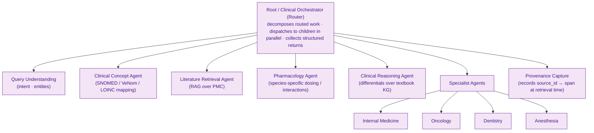
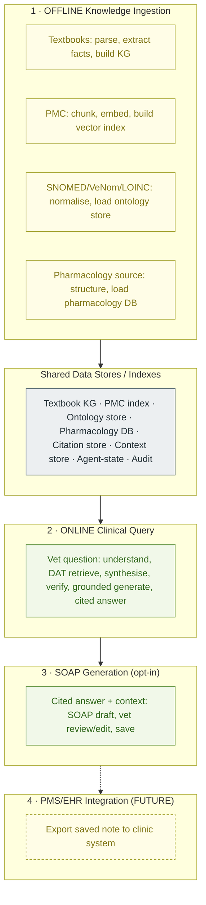
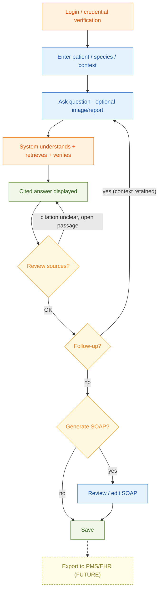

# Veterinary Clinical Intelligence Platform — Product Requirements Document (PRD)

**Document status:** Draft v1.0 · For review by Product, Engineering, AI/ML, Clinical, UX, QA, and Compliance
**Date:** 2026-09-27
**Owner:** Product Management
**Source of truth:** [`ARCHITECTURE.md`](./ARCHITECTURE.md), [`DIAGRAMS_EXPLAINED.md`](./DIAGRAMS_EXPLAINED.md), [`README.md`](./README.md)

**Convention used throughout this document:** Anything that the source architecture has *not* yet decided — a specific model, a vector database engine, a cloud provider, an exact API path — is written as **`PROPOSED — TBD`**. We deliberately do not invent these. Where a decision is genuinely open, it is preserved as an open decision (see Section 22) rather than answered prematurely.

**One rule sits above all others in this product:** the AI writes the answer, but it never invents the facts. Every clinical statement the veterinarian sees must be traceable to a real, retrieved, verified source. The platform assists a veterinarian's judgment; it never replaces it, and it never quietly decides on the vet's behalf.

---

## 1 · Product Overview

The Veterinary Clinical Intelligence Platform is a decision-support tool for practising veterinarians. A vet brings a real clinical question — for example, *"What are the likely causes and diagnostic approach for kidney disease in a cat?"* — and the platform returns a clear, structured, **fully cited** answer drawn from trusted veterinary knowledge, and can turn that answer into a structured clinical note.

What makes this different from a general chatbot is the order of operations. A chatbot answers from memory. This platform does the opposite: it **finds the evidence first, then writes**. It reads the question, works out which animal it concerns, translates everyday clinical language into standard medical codes, breaks the question into manageable parts, and hands those parts to a coordinated team of specialist software agents. Those agents retrieve real evidence from veterinary textbooks and current research, a pharmacology database, and clinical code systems. Only after that evidence has been ranked, combined, and checked against its sources does a language model phrase it into a readable answer — and it may only use the evidence it was given.

The result is an answer a veterinarian can trust because they can *see where every claim came from*, and can act on because it is organised the way clinicians think — including, on request, as a **SOAP note** (Subjective, Objective, Assessment, Plan) ready for the medical record.

---

## 2 · Problem Statement

Veterinarians make high-stakes decisions under time pressure, often across many species, with far less species-specific tooling than human medicine enjoys. The knowledge they need is real and exists — in textbooks, in the research literature, in drug references — but it is scattered, slow to search, and inconsistent across sources. In a consultation, a vet cannot realistically cross-check a differential list against current literature, confirm a species-appropriate drug dose, and align terminology to standard codes, all in the few minutes available.

General-purpose AI assistants make this worse rather than better. They produce fluent, confident answers that *sound* authoritative but are frequently unsourced, occasionally fabricated, and dangerously blind to species differences — a dose that is safe for a dog can be lethal for a cat. An unsourced answer is unusable in a clinical setting, because the vet has no way to verify it and remains fully responsible for the outcome.

The problem this product solves is therefore not "answer veterinary questions." It is: **give veterinarians fast, species-aware, evidence-grounded answers whose every claim is traceable to a real source, so the vet can verify and decide with confidence.**

---

## 3 · Target Users & Personas

The primary user is always a **credentialed veterinary professional**. The platform is a professional clinical tool, not a consumer pet-health product, and its guardrails assume a qualified user in the loop.

**Persona A — Dr. Priya, General Practice Veterinarian (primary persona).**
Sees 20–30 patients a day across dogs, cats, and the occasional exotic. Time-poor, broad rather than deep, and personally liable for every clinical decision. She needs a fast second opinion she can defend: a differential list, a sensible diagnostic order, and a species-correct dose — each with a source she can open. She will abandon any tool that is slow, that she cannot trust, or that cannot produce a usable record afterward.

**Persona B — Dr. Chen, Referral / Specialist Veterinarian (secondary persona).**
Works in internal medicine or oncology at a referral hospital. Deep in a narrow domain, and skeptical of AI. He values the platform mainly for rapid literature retrieval and for cross-checking outside his specialty. He will scrutinise citations and will lose trust permanently if a citation does not support the claim attached to it.

**Persona C — Dr. Okafor, Recent Graduate / Early-Career Vet (secondary persona).**
Clinically knowledgeable but not yet fast or confident. Uses the platform to structure her thinking, confirm she has not missed a differential, and learn from the cited sources. For her the citations are not just proof — they are teaching material. She is also the persona most at risk of over-relying on the tool, so the product's "you decide, not us" framing matters most here.

**Persona D — Dr. Alvarez, Clinical Governance / Practice Lead (oversight persona, not a daily user).**
Responsible for clinical safety and quality across a practice or group. Cares about auditability: what was asked, what was retrieved, what was shown, and whether the tool ever presented an unsupported claim. This persona shapes the audit and safety requirements even though they rarely run a query themselves.

---

## 4 · User Needs & Pain Points

These are the needs the product must serve, each stated as the user would feel it, followed by the pain it removes.

- **"I need to trust the answer enough to act on it."** Vets are liable and will not act on unsourced text. *Pain removed:* every claim is tied to a visible, openable source; nothing reaches the vet that failed verification.
- **"I need the answer to be right for *this* species."** Cross-species drug and dosing errors are a real safety hazard. *Pain removed:* species is detected and carried through every step; pharmacology is looked up per species; cross-species claims are flagged.
- **"I don't have time to search five places."** The evidence exists but is scattered and slow. *Pain removed:* one question fans out across textbooks, research, ontologies, and drug data in parallel and returns a combined answer.
- **"I need to check the source myself when it matters."** Trust requires the ability to verify, not just be told. *Pain removed:* the vet can open the exact passage behind any claim.
- **"I need to know when the evidence is thin."** A confident answer over weak evidence is worse than an honest "we don't have strong evidence here." *Pain removed:* the product surfaces uncertainty and low-evidence situations rather than hiding them.
- **"I need a record at the end, not more work."** A clinical answer that can't become documentation costs time. *Pain removed:* the answer can be turned into a structured, cited SOAP note the vet reviews and edits.
- **"I need it to help me think, not think for me."** Vets reject tools that feel like they're taking over. *Pain removed:* the platform presents evidence and options and leaves the decision explicitly with the vet.

---

## 5 · Product Vision

Every veterinarian, anywhere, should be able to ask a real clinical question and — within the span of a consultation — receive a clear, species-correct answer whose every claim they can trace back to trusted veterinary knowledge, and turn that answer into a clinical record without extra work.

We are building the veterinarian's trusted clinical research partner: fast enough to use mid-consult, honest about what the evidence does and does not support, and transparent enough that the vet always remains the decision-maker. Success looks like a tool vets reach for because it makes them faster *and* safer — never one that makes them dependent or complacent.

---

## 6 · Product Goals & Non-Goals

**Goals (what V1 and the near roadmap commit to):**

1. Return **citation-grounded** clinical answers where every claim maps to a verifiable source.
2. Be **species-aware** end to end, so answers and especially drug information are correct for the animal in question.
3. Retrieve and combine evidence from **veterinary textbooks, PubMed Central research, clinical ontologies (SNOMED CT / VeNom / LOINC), and a pharmacology database.**
4. Coordinate the work through **DAT orchestration** — a disciplined parent→child→parent agent tree — rather than a loose collection of chatbots.
5. **Verify citations deterministically** and reject unsupported claims *before* the answer is written.
6. Generate **structured SOAP notes** from a cited answer, which the vet reviews and edits.
7. Keep the veterinarian **in control**: present evidence and options, never auto-decide.
8. Make the whole interaction **auditable** for clinical governance.

**Non-Goals (explicitly out of scope, to prevent scope creep):**

1. The platform is **not an autonomous veterinarian** and does not make or execute clinical decisions.
2. It does **not** diagnose or prescribe on its own authority; it supports a qualified vet who decides.
3. It is **not** a consumer / pet-owner product.
4. It does **not** answer from the language model's own memory; the model is a writer over retrieved evidence only.
5. It does **not** integrate with clinic practice-management (PMS) / EHR systems in V1 — that is `FUTURE`.
6. It does **not** claim completeness of the world's veterinary literature; its knowledge is bounded by its ingested sources, and it says so.
7. It is **not** a general-purpose chatbot and will decline or redirect out-of-scope requests.

---

## 7 · Key Use Cases

1. **Differential and diagnostic workup.** *"Likely causes and diagnostic approach for kidney disease in a cat."* → cited differentials, a sensible diagnostic order, relevant lab markers, with sources.
2. **Species-specific drug and dosing check.** *"Safe dose of benazepril for a cat in CKD, and interactions to watch."* → per-species dosing, side effects, interactions, each cited; cross-species mismatches flagged.
3. **Literature lookup on a focused clinical question.** *"What does recent research say about SDMA for early feline CKD detection?"* → ranked, cited passages from PMC.
4. **Terminology / coding alignment.** Behind the scenes on every query, and surfacable on request: mapping the clinical concept to SNOMED CT, VeNom, and LOINC so the record and downstream systems agree.
5. **Follow-up within the same case.** The vet asks a related question and the patient/species context is retained, so they don't re-enter it.
6. **Turn the answer into a SOAP note.** The cited answer becomes a structured, editable Subjective/Objective/Assessment/Plan note for the record.
7. **Governance review (oversight).** A practice lead reviews what was asked, retrieved, and shown, including whether any unsupported claim was ever surfaced.

---

## 8 · End-to-End User Journey

The vet's real path, from opening the app to saving a record:

1. **Log in.** Credentials are verified and the vet's permissions are established. *(AuthN/AuthZ — `PROPOSED — TBD` on exact mechanism.)*
2. **Start a query and set context.** The vet enters the patient and species, and any relevant context (age, signs, lab values, an image or report).
3. **Ask the question** in natural clinical language, and submit.
4. **The system understands the case** — reads the question, confirms the species, maps the concepts to standard codes, and breaks the question into parts. The vet sees a clear "working on it" state, not a frozen screen.
5. **The system retrieves and coordinates.** The DAT tree fans the sub-questions out to specialist agents in parallel; each retrieves real evidence from its source.
6. **Evidence is combined and checked.** Findings are ranked, synthesised, and every candidate claim is verified against its source; unsupported claims are dropped *before* writing.
7. **The cited answer is displayed** — organised, readable, with each claim's source visible and openable.
8. **The vet reviews the sources.** They can open the exact passage behind any claim. If a citation is unclear, they stay on the answer and inspect it.
9. **The vet asks a follow-up** (context retained) or moves on.
10. **Optionally, generate a SOAP note.** The vet reviews and edits it.
11. **Save.** (Export to PMS/EHR is `FUTURE`.)

This journey is drawn in Section 26 (User Flow) and traced message-by-message in Section 27 (End-to-End Example).

---

## 9 · Product Principles

These principles resolve trade-offs when requirements conflict. When in doubt, favour the earlier principle.

1. **Evidence before words.** We always retrieve and verify before we generate. If we cannot ground a claim, we do not make it.
2. **The vet decides.** The product supports judgment; it never substitutes for it, and it never takes a clinical action silently.
3. **Species is never assumed away.** Species awareness is a safety property, not a nicety, and it flows through every step.
4. **Honesty about uncertainty.** We would rather say "the evidence here is limited" than sound confident on thin ground.
5. **Traceable by default.** Every claim carries its source; the vet can always check.
6. **A disciplined tree, not a crowd.** Agents communicate only parent↔child. No arbitrary agent-to-agent chatter — it keeps behaviour predictable, debuggable, and auditable.
7. **Bounded, not omniscient.** We are only as good as our ingested sources, and we tell the truth about those bounds.
8. **Auditable always.** If it happened, it was logged and can be reviewed.

---

## 10 · Functional Requirements

Requirements are written to be specific and testable. Acceptance criteria (**AC**) are given for the most important ones. IDs are stable references for engineering and QA.

**Authentication, context, and session**

- **FR-001 — Authenticated access.** Only credentialed veterinary users may access clinical functions; the system enforces authentication and role-based permissions at the single entry point. *(Mechanism `PROPOSED — TBD`.)*
  **AC:** An unauthenticated request to any clinical endpoint is rejected; a valid session is required before any query runs; permission level is recorded with each request.
- **FR-002 — Patient and species context capture.** The vet can enter patient identity, species, and clinical context (signs, history, lab values, optional image/report) before or with a question.
  **AC:** A query can carry structured patient/species context; missing species triggers detection (FR-004) and, if still ambiguous, a prompt to the vet.
- **FR-003 — Context retention across follow-ups.** Within a case, follow-up questions retain the patient/species/context without re-entry.
  **AC:** A follow-up query in the same session reuses stored context; the vet can view and edit that context.

**Understanding the question**

- **FR-004 — Species detection.** The system determines the species from the context/question and carries it through every downstream step.
  **AC:** For a query naming or implying a species, species is identified with a confidence value; low confidence prompts confirmation rather than a silent guess.
- **FR-005 — Clinical concept mapping.** Everyday clinical language is mapped to standard codes — **SNOMED CT, VeNom, and LOINC** — so terminology is consistent and records align. *(Endpoint `POST /api/v1/ontology/map` — `PROPOSED`.)*
  **AC:** A recognised clinical term returns its corresponding standard code(s); unmapped terms are flagged, not dropped.
- **FR-006 — Query decomposition.** A broad question is broken into focused sub-questions (e.g. causes, diagnostics, staging, therapeutics) so each can be handled by the right agent.
  **AC:** A compound clinical question yields multiple labelled sub-questions routed to appropriate agents.

**Retrieval and orchestration (DAT)**

- **FR-007 — DAT orchestration.** A Root/Router agent decomposes the routed work and dispatches sub-questions to child agents in parallel; children return structured results to the Root and never communicate peer-to-peer. *(Endpoint `POST /api/v1/agents/route` — `PROPOSED`.)*
  **AC:** For a multi-part query, child agents run concurrently; the execution graph shows only parent↔child edges; each child returns `{evidence[], source_ids[], confidence, metadata}`.
- **FR-008 — Literature retrieval (RAG over PMC).** The Literature agent embeds the sub-question, retrieves top-matching passages from the PMC vector index, and re-ranks them. *(Endpoint `POST /api/v1/retrieval/search` — `PROPOSED`; vector DB, embedding & re-ranker models — `TBD`.)*
  **AC:** Retrieval returns passages with document IDs and scores; re-ranking reorders by relevance; every returned passage carries a source ID.
- **FR-009 — Textbook/factual knowledge retrieval.** The Clinical Reasoning and Specialist agents retrieve established facts from the textbook knowledge store.
  **AC:** Factual queries return facts with source references to the originating textbook material.
- **FR-010 — Pharmacology retrieval (species-specific).** The Pharmacology agent returns drug information keyed by drug **and species**: dosing, side effects, and interactions.
  **AC:** A `{drug, species}` lookup returns species-specific dosing and interactions with sources; a drug/species combination with no data returns an explicit "no species-specific data" result, never a substituted or cross-species dose.
- **FR-011 — Specialist agents.** Domain specialist agents (Internal Medicine, Oncology, Anesthesia, Dentistry) analyse the sub-question within their domain and return findings with sources and confidence. *(Which specialties ship in V1 — see Section 23.)*
  **AC:** A relevant specialist is engaged for a query in its domain and returns domain findings with source IDs and a confidence value.

**Synthesis, verification, and generation**

- **FR-012 — Evidence ranking and synthesis.** After all children return, evidence is ranked/re-ranked, specialist findings are summarised, and the Root synthesises a single candidate answer with a claim→source map. *(Endpoint `POST /api/v1/synthesis` — `PROPOSED`.)*
  **AC:** Synthesis runs only after all dispatched children complete (or time out gracefully); output includes a mapping from each candidate claim to its source ID(s).
- **FR-013 — Deterministic citation verification.** Every candidate claim is checked, by strict matching (not by the model's guess), against the passage/source it cites. *(Endpoint `POST /api/v1/citations/verify` — `PROPOSED`.)*
  **AC:** Claims whose cited source does not support them are marked unverified and are not presented as supported facts; the check is reproducible for the same inputs.
- **FR-014 — Grounded generation.** The language model writes the final answer using **only** verified, approved evidence and citations; it may not introduce facts of its own. *(Model — `TBD`.)*
  **AC:** The generated answer contains no supported-fact claim that lacks an approved citation; a test that strips the retrieved context yields no clinical claims.
- **FR-015 — Cited answer presentation.** The answer is shown organised and readable, with each claim's source visible and openable to the exact passage. The query response carries not just the answer and its citations but also an **answer-level confidence** and any **flags** (e.g. limited/conflicting evidence). The response contract is: success `{answer, citations[], confidence, flags[], soap?}`; and the alternate responses `{needs_clarification, options[]}` (species/scope confirmation needed) and `{out_of_scope, reason}`. *(Exact field types — `TBD`.)*
  **AC:** Each factual statement displays its citation; selecting a citation reveals the source passage/reference; the response includes `confidence` and `flags[]`, and returns `needs_clarification` or `out_of_scope` where applicable instead of a fabricated answer.

**SOAP and output**

- **FR-016 — SOAP generation.** On request, a cited answer is converted into a structured SOAP note (Subjective, Objective, Assessment, Plan) with citations preserved. *(Endpoint `POST /api/v1/soap/generate` — `PROPOSED`.)*
  **AC:** The SOAP note has all four sections populated appropriately, retains citations, and is editable by the vet before saving.
- **FR-017 — Review and edit.** The vet can edit the SOAP note (and see the underlying citations) before saving.
  **AC:** Edits are captured; the saved note reflects the vet's final version, with an audit record of AI-generated vs vet-edited content.
- **FR-018 — Save.** The vet can save the answer and/or SOAP note to the case. **(Export to PMS/EHR is `FUTURE` — FR-019.)**
  **AC:** A saved item is retrievable within the case/session.
- **FR-019 — PMS/EHR export `(FUTURE)`.** Exporting to external clinic systems is planned but out of V1 scope.

**Uncertainty, scope, and audit**

- **FR-020 — Uncertainty and low-evidence handling.** When evidence is weak, sparse, or conflicting, the answer says so explicitly rather than presenting false confidence.
  **AC:** A query with little retrievable evidence returns an explicit low-evidence statement; conflicting sources are surfaced, not silently reconciled.
- **FR-021 — Out-of-scope handling.** Non-clinical or out-of-domain requests are declined or redirected; the product does not behave as a general chatbot.
  **AC:** An out-of-scope prompt returns a scope-appropriate response, not a fabricated clinical answer.
- **FR-022 — Auditability.** The system records, for each query, what was asked, what was retrieved, what was verified/rejected, and what was shown.
  **AC:** For any completed query, an authorised reviewer can reconstruct the inputs, retrieved sources, verification outcomes, and final output.

---

## 11 · AI / Clinical Intelligence Requirements

These govern how the AI components must behave. They are the heart of clinical trust.

- **AI-001 — Retrieval-grounded generation only.** The model generates strictly over retrieved, verified context. It is never treated as a knowledge source.
  **AC:** With retrieved context removed, the system produces no clinical claims (mirrors FR-014).
- **AI-002 — Claim-level source attribution.** Each clinical claim is attributable to a specific source span/passage, not merely to a document in general.
  **AC:** Every supported claim links to a specific passage/reference, not a whole document without location.
- **AI-003 — Species-conditioned reasoning.** All clinical and pharmacological reasoning is conditioned on the detected/confirmed species.
  **AC:** Changing the species changes species-dependent outputs (especially dosing); no dose is presented without a species.
- **AI-004 — Confidence reporting.** Agents report a confidence value with their findings, and low aggregate confidence is reflected to the vet.
  **AC:** Findings carry confidence; the final answer reflects low confidence honestly.
- **AI-005 — No peer-to-peer agent reasoning.** Agents reason only within their scope and report to the Root; they do not negotiate answers among themselves.
  **AC:** The run graph shows only parent↔child communication (mirrors FR-007).
- **AI-006 — Synthesis after retrieval.** Synthesis and ranking occur only after retrieval completes; the model does not "fill gaps" from memory during retrieval.
  **AC:** Trace shows retrieval fully precedes synthesis for every claim.
- **AI-007 — Deterministic verification gate.** The citation-verification step is deterministic and blocks unverified claims from generation.
  **AC:** Identical inputs yield identical verification outcomes; unverified claims never reach the generated answer as supported facts.
- **AI-008 — Graceful degradation.** If a child agent or source is unavailable, the system returns a reduced but honest answer noting the gap, rather than fabricating to fill it.
  **AC:** With one source disabled, the answer omits or flags that dimension instead of inventing content.
- **AI-009 — Evidence freshness signalling.** Where a source has a date (especially PMC literature), that date is available so the vet can judge currency; the system communicates that its knowledge is bounded by its ingested sources and their dates.
  **AC:** Literature citations expose their publication date; the product states its knowledge is limited to ingested sources.

---

## 12 · Knowledge & Evidence Strategy

The platform's trustworthiness rests entirely on the quality and traceability of what it retrieves. The strategy separates two "families" of knowledge and treats them differently.

**Foundational, established knowledge — veterinary textbooks (25–30).** These provide settled, peer-reviewed facts and relationships and act as the factual backbone. They are ingested offline into a **textbook knowledge store / knowledge graph** that captures facts and how concepts relate. This is the source the Clinical Reasoning and Specialist agents lean on for "what is generally true."

**Current, evolving knowledge — PubMed Central (PMC) research literature.** This provides recent evidence. It is chunked, embedded, and stored in a **PMC vector index** so the system can search *by meaning*, not just keywords. Because research evolves and can conflict, PMC results carry dates and are always ranked and verified before use.

**Standard clinical vocabularies — SNOMED CT, VeNom, LOINC.** These are not "answers"; they are the shared language that keeps terminology consistent and records aligned. They live in a **clinical ontology store** and are used to map the vet's words to codes (concepts, veterinary nomenclature, and lab observations respectively).

**Pharmacology data.** Drugs, **species-specific dosing**, side effects, and interactions live in a dedicated **pharmacology database**, queried by drug and species. This is treated as safety-critical: a missing species entry must return "no data," never a substitute.

**Provenance — the citation / evidence store.** Every retrievable unit of knowledge is tied to a `source_id` that maps to a specific span/DOI/passage. This store is what makes deterministic verification and "open the exact source" possible.

**Evidence quality principles:** prefer the most authoritative source for the claim type (textbooks for established facts, PMC for current evidence); always retain provenance to the passage level; expose dates so currency is visible; and never blend sources in a way that erases where a claim came from.

*(Ingestion detail is in Section 26/Data Flow. Source list, licensing, and update cadence for each corpus are open items — see Section 22.)*

---

## 13 · Specialist Agent / DAT Architecture

**What DAT is, in plain terms.** DAT stands for **Directed Acyclic Tree**. Think of a hospital team with one team leader and several specialists. The leader (the **Root/Router agent**) receives the broken-down question and hands each part to the right specialist. The specialists work **at the same time**, each does one job, and each **reports back to the leader** — never to each other. "Acyclic tree" simply means the work flows down from the leader to the specialists and back up, and never loops around sideways. This is deliberately *not* a free-for-all where agents chat amongst themselves, because that would make behaviour unpredictable, hard to debug, and impossible to audit.

**Why a tree and not a mesh.** A disciplined parent→child→parent structure gives us three things clinical software must have: predictability (we always know who asked what of whom), traceability (every finding has a clear owner and source), and safety (nothing gets combined until retrieval and verification are done).

**The tree:**



**Node responsibilities, inputs, and outputs:**

| Node | Responsibility | Input (from Root) | Output (to Root) |
|---|---|---|---|
| **Root / Router** | Decompose routed work, dispatch sub-questions in parallel, collect returns, trigger synthesis | `{subqueries[], concepts[], species, patient_ctx}` | orchestrated candidate answer + claim→source map (via Synthesis) |
| **Query Understanding** | Extract intent and clinical entities | question text + context | `{intent, entities[]}` |
| **Clinical Concept Agent** | Map terms to SNOMED/VeNom/LOINC; expand concepts | `{terms[], species}` | `{codes[], concept_ids[], confidence}` |
| **Literature Retrieval Agent** | Embed sub-question, retrieve top-k from PMC index, re-rank | `{subquery, concepts[], species}` | `{passages[], doc_ids[], scores[], confidence}` |
| **Pharmacology Agent** | Look up drug info by drug + species | `{drug, species}` | `{drugs[], dosing, interactions[], source_ids[]}` |
| **Clinical Reasoning Agent** | Reason differentials over textbook knowledge | `{subquery, concepts[], species}` | `{evidence[], source_ids[], confidence}` |
| **Specialist Agent(s)** | Domain analysis (IM / Oncology / Dentistry / Anesthesia) | `{subquery, concepts[], species}` | `{specialist_findings[], source_ids[], confidence}` |
| **Provenance Capture** | At retrieval time, record `source_id ↔ span/DOI/passage` for retrieved evidence (enables later verification) | retrieved evidence | provenance rows to the Citation/Evidence Store |

> **Note (verification placement):** *deterministic citation verification is a **post-synthesis gate**, not a DAT child.* It runs **after** all children return and synthesis produces a candidate answer, and **before** generation (see FR-013, AI-006, AI-007). The DAT child above only **captures provenance** during retrieval; it does not decide whether a claim is supported. This resolves the earlier ambiguity where verification was shown both as a child and as a gate.

**The communication contract (non-negotiable):** parent→child dispatch is parallel and scoped; child→parent returns are structured (`{evidence[], source_ids[], confidence, metadata}`); children never talk to each other; synthesis runs only after all children return; the post-synthesis verification gate gates the language model. *(Agent framework / orchestration runtime — `TECHNOLOGY TBD`.)*

---

## 14 · SOAP Workflow

SOAP is the standard clinical note format: **S**ubjective (what's reported/observed as history and signs), **O**bjective (measurable findings, lab values), **A**ssessment (the clinical interpretation / differentials), **P**lan (diagnostics and next steps). The platform can turn a cited answer into a SOAP note so the vet leaves with documentation, not homework.

**How it works and why it's safe:**

1. SOAP generation is **opt-in** — the vet requests it after reviewing the cited answer. We do not silently produce records.
2. It draws from the **already-verified, cited answer** plus the patient/species context — not from a fresh, ungrounded generation. Citations carry through into the note.
3. Each section is populated from the appropriate evidence: history/signs → Subjective; measured/lab data (LOINC-coded) → Objective; differentials and reasoning → Assessment; recommended diagnostics/therapeutics (with species-correct pharmacology) → Plan.
4. The vet **reviews and edits** every section before saving. The system records which content was AI-generated and which was vet-edited (supports FR-017 and audit).
5. The saved note stays with the case; **export to PMS/EHR is `FUTURE`.**

**Requirement anchors:** FR-016 (generate), FR-017 (review/edit), FR-018 (save). *(Endpoint `POST /api/v1/soap/generate` — `PROPOSED`.)*

---

## 15 · UX Requirements

The interface must earn trust in seconds and never make the vet feel it is taking over.

- **UX-001 — Visible, openable citations.** Every claim shows its source; one action opens the exact passage. Citations are first-class, not footnotes.
- **UX-002 — Honest progress, not a frozen screen.** During the (multi-step, parallel) retrieval, the vet sees clear stage feedback ("understanding → retrieving → verifying → writing"), so latency feels like work, not a hang.
- **UX-003 — Species always visible and confirmable.** The detected species is shown and easily corrected; the vet is never left guessing what animal the answer assumes.
- **UX-004 — Uncertainty shown plainly.** Low-evidence and conflicting-evidence states are communicated in plain language, visually distinct from high-confidence answers.
- **UX-005 — "You decide" framing.** Language and layout present evidence and options, not directives. No UI element implies the system has decided for the vet.
- **UX-006 — Frictionless context and follow-up.** Entering patient/species/context is quick; follow-ups reuse it; the vet can view/edit context at any time.
- **UX-007 — Reviewable SOAP.** SOAP notes are clearly editable, show their citations, and never save without the vet's action.
- **UX-008 — Graceful failure messaging.** When a source or agent is unavailable, the UI says what's missing and what the answer therefore does/doesn't cover — never a silent gap.
- **UX-009 — Accessibility & clinical ergonomics.** Readable under clinic conditions (glare, speed, small screens); keyboard-friendly; meets a recognised accessibility standard *(target — `PROPOSED — TBD`)*.
- **UX-010 — Scope clarity.** When a request is out of scope, the UI explains the product's purpose rather than attempting a chatbot-style answer.

---

## 16 · Safety, Trust & Clinical Guardrails

These requirements exist to keep the product safe and honest. They take precedence over answer completeness or speed.

- **SAF-001 — Grounding gate.** No claim is presented as a supported fact unless it passed citation verification. Unverified claims are dropped or explicitly marked as unverified.
  **AC:** Injected unsupported claims never appear as facts in output.
- **SAF-002 — Species / drug safety.** No drug dose is presented without a confirmed species; cross-species dosing is blocked or explicitly flagged as unsupported for that species.
  **AC:** A dose query with ambiguous species prompts confirmation; a cross-species dose is refused or flagged, never silently shown.
- **SAF-003 — Never an autonomous veterinarian.** The product never states a diagnosis or prescription as its own decision; it presents evidence for the vet to act on.
  **AC:** Output phrasing and structure attribute decisions to the vet; no imperative "prescribe X" without evidence-and-vet framing.
- **SAF-004 — Uncertainty disclosure.** Weak or conflicting evidence is disclosed, not smoothed over.
  **AC:** Low-evidence queries return explicit uncertainty (mirrors FR-020).
- **SAF-005 — Unsupported-claim rejection.** The generation step cannot introduce facts beyond approved evidence.
  **AC:** Stripping context yields no clinical claims (mirrors FR-014/AI-001).
- **SAF-006 — Human review of records.** SOAP notes and saved outputs require vet review before they become records.
  **AC:** No note is saved as final without a vet action.
- **SAF-007 — Full auditability.** Every query's inputs, retrieved sources, verification outcomes, and outputs are logged and reviewable.
  **AC:** A governance reviewer can reconstruct any query end to end (mirrors FR-022).
- **SAF-008 — Bounded-knowledge honesty.** The product communicates that its knowledge is limited to ingested sources and their dates.
  **AC:** A "not in my sources" style response is available and used rather than fabrication.
- **SAF-009 — Safe failure.** On component failure, the system degrades to an honest, reduced answer rather than a fabricated complete one (mirrors AI-008).

---

## 17 · Data & Privacy Requirements

- **DP-001 — Secure entry and transport.** All external access passes a single authenticated gateway; traffic is encrypted in transit; internal services communicate over a secured internal channel. *(Exact mechanisms — `PROPOSED — TBD`.)*
- **DP-002 — Role-based access.** Access to clinical functions and to patient context is limited by the user's role and permissions.
- **DP-003 — Patient context protection.** Patient/clinical context is stored in a dedicated store, access-controlled, and not exposed beyond what a query needs.
- **DP-004 — Data separation.** Knowledge sources, patient context, agent state, and audit logs are held in **separate stores** with appropriate access rules, so clinical data is not commingled with corpus data.
- **DP-005 — Audit log integrity.** Audit/observability records are retained and protected so governance review is reliable.
- **DP-006 — Source licensing compliance.** Ingested corpora (textbooks, PMC, ontologies, pharmacology) are used within their licences. *(Per-source licence terms — open item, Section 22.)*
- **DP-007 — Data residency & retention.** Storage location and retention periods for patient context and audit data must meet applicable regulation. *(Specifics — `PROPOSED — TBD`; regulatory scope is an open decision, Section 22.)*
- **DP-008 — Minimisation.** The system collects and retains only the patient/clinical data needed to answer and document; images/reports are handled under the same controls as other patient data.

---

## 18 · Success Metrics

Metrics are grouped by what they protect. Targets marked `PROPOSED — TBD` need baseline data before being set.

**Trust & safety (the metrics that gate launch):**
- **Citation faithfulness:** % of presented claims whose source genuinely supports them, on a clinician-reviewed sample. *Target: very high; exact threshold `PROPOSED — TBD`.* This is the single most important metric.
- **Unsupported-claim rate:** frequency of any unsupported claim reaching the vet. *Target: effectively zero.*
- **Species/drug safety incidents:** count of cross-species or species-less dosing errors surfaced. *Target: zero.*
- **Uncertainty honesty:** % of low-evidence cases correctly surfaced as such (clinician-judged).

**Clinical usefulness:**
- **Answer usefulness rating:** vet-rated usefulness per answer.
- **Citation open rate & confirmation:** how often vets open sources and find them supportive (a trust signal, not just usage).
- **Task completion:** % of queries that reach a usable answer / SOAP note without abandonment.

**Efficiency & adoption:**
- **Time-to-answer:** end-to-end latency (see NFR-001).
- **Repeat use / retention:** vets returning to the tool.
- **SOAP acceptance:** % of generated SOAP notes saved with minimal edits.

**Operational:**
- **Verification pass/reject rates**, **agent success/timeout rates**, **retrieval relevance** (offline eval on a curated question set).

---

## 19 · Non-Functional Requirements

- **NFR-001 — Responsiveness.** End-to-end answer latency must be low enough to use mid-consultation. *Target — `PROPOSED — TBD`; must account for parallel retrieval + verification.*
  **AC:** p95 latency for a standard query meets the agreed target once set.
- **NFR-002 — Availability.** The service meets an agreed uptime target. *Target — `PROPOSED — TBD`.*
- **NFR-003 — Scalability.** The system scales to concurrent vets without loss of correctness; parallel DAT execution must not degrade citation integrity under load.
- **NFR-004 — Reliability & graceful degradation.** Component failures produce reduced-but-honest answers, not errors or fabrications (ties to AI-008/SAF-009).
- **NFR-005 — Security.** Authentication, authorisation, encryption in transit, and internal-channel protection as per Section 17. *(Mechanisms `TBD`.)*
- **NFR-006 — Observability.** Every run emits traces/logs/metrics sufficient to debug and to support audit (Section 16/17).
- **NFR-007 — Maintainability & extensibility.** New knowledge sources, ontologies, or specialist agents can be added without redesign; the DAT contract makes agents pluggable.
- **NFR-008 — Reproducibility of verification.** The citation-verification step yields identical results for identical inputs (ties to AI-007).
- **NFR-009 — Data integrity.** Provenance (`source_id ↔ span`) is never lost through ingestion, retrieval, synthesis, or SOAP generation.
- **NFR-010 — Portability of decisions.** Because models/DB/cloud are `TBD`, components are isolated behind clear interfaces so a model or store can be swapped without rewrites.

---

## 20 · Risks & Mitigations

| # | Risk | Impact | Mitigation |
|---|---|---|---|
| R-1 | **Fabricated or mis-attributed claims** reach a vet | Clinical harm, loss of trust | Deterministic verification gate (SAF-001/AI-007); grounded-only generation (FR-014); citation faithfulness as launch gate |
| R-2 | **Cross-species drug error** | Patient harm | Species carried end-to-end (AI-003); no dose without species (SAF-002); pharmacology returns "no data" not substitutes (FR-010) |
| R-3 | **Over-reliance / automation bias** by vets (esp. early-career) | Deskilling, unchecked errors | "You decide" framing (UX-005/SAF-003); mandatory human review of records (SAF-006); visible uncertainty (UX-004) |
| R-4 | **Latency too high** for mid-consult use | Abandonment | Parallel DAT retrieval; progress feedback (UX-002); latency targets (NFR-001) |
| R-5 | **Stale or conflicting literature** presented as current | Wrong decisions | Freshness signalling (AI-009); conflict disclosure (FR-020); textbook vs PMC separation (Section 12) |
| R-6 | **Knowledge gaps** (source doesn't cover the question) | Misleading confidence | Bounded-knowledge honesty (SAF-008); low-evidence disclosure (FR-020) |
| R-7 | **Verification is too strict/too loose** | Useful claims dropped, or bad claims pass | Tune on clinician-reviewed sets; measure pass/reject; keep deterministic + reproducible (NFR-008) |
| R-8 | **Undecided tech (model/DB/cloud)** causes rework | Delivery risk | Interface isolation (NFR-010); `PROPOSED — TBD` discipline; decide via Section 22 before build of dependent parts |
| R-9 | **Privacy / regulatory** gaps for patient data | Legal/compliance exposure | Data separation & access control (Section 17); resolve residency/retention/regulatory scope (Section 22) |
| R-10 | **Source licensing** issues | Legal exposure, corpus removal | Licence compliance (DP-006); confirm terms per source before ingestion |

---

## 21 · Assumptions

1. Users are **credentialed veterinary professionals**, not pet owners.
2. The **textbook (25–30) and PMC corpora, plus SNOMED/VeNom/LOINC and a pharmacology source, are obtainable and licensable** for this use.
3. A **veterinarian is always in the loop** and remains the decision-maker and record-owner.
4. **Deterministic citation verification is technically achievable** to the fidelity clinical trust requires.
5. **Species can be reliably determined** from context or explicit input, with confirmation when unsure.
6. **PMS/EHR integration is deferred**; V1 does not depend on external clinic systems.
7. Model, vector DB, orchestration runtime, and cloud are **not yet chosen** and will be selected against these requirements.
8. Reasonable **compute and infrastructure** for embeddings, retrieval, re-ranking, and generation will be available.

---

## 22 · Open Questions / Decisions Required

Preserved as open decisions rather than invented answers. Each needs an owner and a decision date.

- **OQ-1 — Foundation LLM:** which model writes the answers? (`MODEL TBD`)
- **OQ-2 — Embedding & re-ranker models:** which models power semantic retrieval and re-ranking? (`MODEL TBD`)
- **OQ-3 — Vector database:** which engine backs the PMC index? (`TECHNOLOGY TBD`)
- **OQ-4 — Knowledge-graph / textbook store engine:** which technology? (`TECHNOLOGY TBD`)
- **OQ-5 — Pharmacology DB engine and source:** which database, and which pharmacology data source(s)? (`TBD`)
- **OQ-6 — Agent framework / orchestration runtime:** what runs the DAT? (`TECHNOLOGY TBD`)
- **OQ-7 — Cloud provider / deployment target.** (`TBD`)
- **OQ-8 — Exact API surface:** the endpoints listed are `PROPOSED`; finalise contracts.
- **OQ-9 — Specialist agents in V1:** which of Internal Medicine / Oncology / Dentistry / Anesthesia ship first? (see Section 23)
- **OQ-10 — Regulatory scope:** which jurisdictions/regulations govern this as veterinary decision-support, and what do they require of data residency, retention, and record-keeping?
- **OQ-11 — Source licences & update cadence:** licence terms and refresh schedule per corpus (textbooks, PMC, ontologies, pharmacology).
- **OQ-12 — Accessibility standard target** (UX-009).
- **OQ-13 — Metric thresholds:** citation-faithfulness, latency, availability targets (Sections 18/19) need baselines before they are set.
- **OQ-14 — Image/report handling:** to what extent are uploaded images/reports interpreted vs. attached as context in V1?

---

## 23 · MVP vs Future Scope

**MVP (V1) — the smallest product that is genuinely trustworthy and useful.** The MVP must deliver an end-to-end, cited, species-aware answer with verification. Anything not essential to *that* waits.

**In MVP:**
- Authenticated access and patient/species context capture (FR-001–FR-004).
- Concept mapping to SNOMED/VeNom/LOINC (FR-005) and query decomposition (FR-006).
- DAT orchestration with the core children: Clinical Reasoning, Literature/PMC retrieval, Ontology, Pharmacology, and Evidence/Citation Verification (FR-007–FR-010, FR-013).
- **At least one specialist agent** — proposed: **Internal Medicine** — to prove the specialist pattern (FR-011). *Which one(s) → OQ-9.*
- Synthesis, deterministic verification, grounded generation, cited presentation (FR-012–FR-015).
- Uncertainty/low-evidence handling and out-of-scope handling (FR-020, FR-021).
- Core safety guardrails (SAF-001–SAF-005, SAF-008, SAF-009) and auditability (FR-022/SAF-007).
- **Basic SOAP generation with review/edit/save** (FR-016–FR-018) — strong candidate for MVP given its workflow value, *pending validation that verified answers map cleanly into SOAP sections*.

**What must be validated before MVP release:**
- Citation faithfulness on a clinician-reviewed set clears the launch threshold (OQ-13).
- Species/drug safety: zero cross-species/species-less dosing in test sets.
- Latency is acceptable mid-consult (NFR-001).
- Retrieval relevance is good enough on a curated question set.

**Future (post-V1), with dependencies:**
- **Additional specialist agents** (Oncology, Dentistry, Anesthesia) — depends on MVP specialist pattern proving out and domain corpora coverage.
- **PMS/EHR export** (FR-019) — depends on integration partners, data mapping, and OQ-10 regulatory clarity.
- **Image/report interpretation** beyond attachment — depends on OQ-14 and validation.
- **Broader ontology use surfaced to the vet**, richer freshness/conflict tooling, multi-language, and analytics for governance.

**Discipline:** not every proposed capability belongs in MVP. Specialist breadth, PMS integration, and image interpretation are explicitly deferred so V1 can prove the trust core first.

---

## 24 · Release Phases / Roadmap

Phases are outcome-based, not date-based (dates depend on Section 22 decisions).

- **Phase 0 — Foundations & decisions.** Resolve blocking `TBD`s that gate build (models, vector DB, orchestration runtime, cloud, API contracts — OQ-1–OQ-8); confirm source licences (OQ-11); stand up offline ingestion for textbooks, PMC, ontologies, pharmacology.
- **Phase 1 — Trust core (internal).** DAT orchestration + core children + deterministic verification + grounded generation, over the ingested corpora. Goal: a cited answer that passes faithfulness review internally.
- **Phase 2 — MVP (limited clinical pilot).** Add UX, species safety, one specialist agent, uncertainty handling, basic SOAP, audit. Validate against the pre-release gates (Section 23). Release to a small set of pilot vets.
- **Phase 3 — Hardening & broadening.** Add specialist agents, refine verification tuning, meet latency/availability/scalability targets (Section 19), expand governance tooling.
- **Phase 4 — Integration (`FUTURE`).** PMS/EHR export, image interpretation, and other deferred capabilities, gated by regulatory clarity (OQ-10).

---

## 25 · Acceptance Criteria (product-level)

The product is acceptable for MVP release when **all** of the following hold (these summarise and roll up the per-requirement ACs):

1. **Grounded & cited:** every presented clinical claim links to a specific, openable source; stripping retrieved context yields no clinical claims (FR-014, FR-015, AI-001, AI-002).
2. **Verified:** deterministic verification blocks unsupported claims; identical inputs give identical verification results (FR-013, AI-007, NFR-008).
3. **Species-safe:** no dose without a confirmed species; cross-species dosing is refused/flagged; zero safety incidents in the test set (FR-010, AI-003, SAF-002).
4. **Honest:** low-evidence and conflicting-evidence cases are disclosed; out-of-scope requests are handled without fabrication (FR-020, FR-021, SAF-004, SAF-008).
5. **DAT-correct:** execution shows only parent↔child communication; synthesis strictly follows retrieval (FR-007, AI-005, AI-006).
6. **Vet-in-control:** no clinical decision is presented as the system's own; records require vet review before save (SAF-003, SAF-006).
7. **Auditable:** any query can be reconstructed end to end by an authorised reviewer (FR-022, SAF-007).
8. **Usable:** end-to-end answer within the agreed latency target with clear progress feedback (NFR-001, UX-002).
9. **SOAP (if in MVP):** generated notes populate all four sections, retain citations, and are editable and reviewed before save (FR-016–FR-018).
10. **Faithfulness gate:** citation-faithfulness on the clinician-reviewed sample clears the agreed threshold (OQ-13).

---

## 26 · Architecture Diagrams

This section gives the product-level views. The exhaustive, engineering-grade diagrams (fully labelled low-level architecture and the complete connection register) already live in [`ARCHITECTURE.md`](./ARCHITECTURE.md) and are the authoritative technical reference; they are not duplicated here.

### A · High-Level Architecture (layered)

```mermaid
flowchart LR
  classDef user fill:#E3F2FD,stroke:#1565C0,color:#0D47A1;
  classDef api fill:#E8F5E9,stroke:#2E7D32,color:#1B5E20;
  classDef orch fill:#FFF3E0,stroke:#EF6C00,color:#E65100;
  classDef dat fill:#F3E5F5,stroke:#6A1B9A,color:#4A148C;
  classDef know fill:#FCE4EC,stroke:#AD1457,color:#880E4F;
  classDef model fill:#E0F7FA,stroke:#00838F,color:#006064;
  classDef safety fill:#FFEBEE,stroke:#C62828,color:#B71C1C;
  classDef out fill:#F1F8E9,stroke:#558B2F,color:#33691E;

  VET["Veterinarian<br/>question · species · patient context"]:::user
  APP["Application + API Gateway<br/>auth · session · patient context"]:::api
  ORCH["Clinical Intelligence Layer<br/>understand · detect species · map concepts · decompose"]:::orch
  DAT["DAT Orchestrator<br/>Root/Router to parallel children back to Root"]:::dat
  KNOW["Knowledge & Retrieval Layer<br/>Textbook KG · PMC index · Ontologies · Pharmacology · Citation store"]:::know
  SPEC["Specialist Agents<br/>Internal Medicine · Oncology · Dentistry · Anesthesia"]:::dat
  MODEL["Model Layer<br/>Embedding · Re-ranker · LLM (all MODEL TBD)"]:::model
  SAFE["Safety & Citation Layer<br/>deterministic verification · grounding checks"]:::safety
  OUT["Clinical Output<br/>cited answer"]:::out
  SOAP["SOAP / PMS integration<br/>SOAP now · PMS/EHR FUTURE"]:::out

  VET --> APP --> ORCH --> DAT
  DAT --> KNOW
  DAT --> SPEC
  DAT --> MODEL
  KNOW --> SAFE
  SPEC --> SAFE
  SAFE --> MODEL
  MODEL --> OUT --> SOAP
```



### B · Low-Level Architecture

The full low-level architecture — every service, agent, store, index, model call, auth boundary, and the complete labelled **connection register** (what data moves on each edge and why) — is maintained in [`ARCHITECTURE.md` §2 and §2a](./ARCHITECTURE.md). Key component responsibilities are captured in Section 13 (agents) and the architecture explanation table in part G below.

### C · DAT Architecture

See the parent→child tree and node responsibility table in **Section 13**.

### D · Data Flow (four separated flows)



The four flows are deliberately separate: ingestion happens **beforehand** (offline), query processing happens **live** (online), SOAP is an **opt-in** step after a verified answer, and PMS/EHR is **future**. They meet only at the shared stores. (Matches [`ARCHITECTURE.md` §3](./ARCHITECTURE.md).)

### E · Sequence Diagram

See **Section 27**, which traces the kidney-disease-in-a-cat query message by message.

### F · User Flow



### G · Architecture Explanation (per component)

| Component | Responsibility | Inputs | Outputs | Depends on | User impact | Failure behaviour | Key requirement |
|---|---|---|---|---|---|---|---|
| **API Gateway + Auth** | Single secured entry; authN/authZ; session | vet request | routed internal request | Auth service, context store | Access control; nothing works without it | Reject/deny, no fallback bypass | FR-001, DP-001/002 |
| **Clinical Intelligence Layer** | Understand, detect species, map concepts, decompose | question + context | intent, species, codes, sub-questions | Ontology store | Right species & terms mean a safe, relevant answer | Prompt vet on ambiguity | FR-004–FR-006, AI-003 |
| **DAT Root/Router** | Dispatch sub-questions in parallel; collect returns; trigger synthesis | sub-questions, concepts, species | orchestrated evidence | Agent-state store, children | Faster, structured answers | Degrade to available children | FR-007, AI-005/006 |
| **Literature/PMC Agent** | Embed, retrieve top-k, re-rank | sub-question | ranked passages + source IDs | Embedding, vector index, re-ranker (TBD) | Current research, cited | Return fewer / flag gap | FR-008, AI-009 |
| **Clinical Reasoning / Specialist Agents** | Differentials / domain analysis over textbook KG | sub-question, species | findings + source IDs + confidence | Textbook KG | Expert-level, cited reasoning | Reduced coverage, flagged | FR-009, FR-011 |
| **Pharmacology Agent** | Species-specific drug lookup | drug + species | dosing, interactions + sources | Pharmacology DB | Safe, species-correct drug info | "No data" not substitute | FR-010, SAF-002 |
| **Evidence/Citation Verification** | Deterministic claim↔source match | claims + claim-source map | verified / unverified + flags | Citation store | Trust: only supported claims shown | Block unverified claims | FR-013, SAF-001, AI-007 |
| **Synthesis** | Rank, combine into candidate answer + claim-source map | all evidence | candidate answer + map | — | Coherent single answer | Partial synthesis, flagged | FR-012 |
| **Safety / Grounding** | Drop ungrounded claims before generation | verified claims | grounded context | — | No made-up medicine | Reject rather than pass | SAF-005, FR-014 |
| **Foundation LLM** | Write answer over verified context only | grounded context + citations | cited draft answer | Model (TBD) | Readable, trustworthy answer | Honest reduced answer | FR-014, AI-001 |
| **SOAP Generator** | Turn cited answer into SOAP | answer + context + citations | editable SOAP note | LLM (optional) | Documentation without extra work | Vet writes manually | FR-016–FR-018 |
| **Audit/Observability** | Log inputs, retrieval, verification, output | all events | traces/logs/metrics | — | Governance & safety review | Alert on logging failure | FR-022, SAF-007 |

---

## 27 · End-to-End Example

> **Note:** this is a **simplified illustration** of the query path. The authoritative, non-collapsed sequence — including the Scope Guardrail, Clarification Gate, Provenance Capture, the post-synthesis verification gate, and the full `{answer, citations[], confidence, flags[]}` response contract — is in [`PRODUCT_FLOW_SPEC.md`](./PRODUCT_FLOW_SPEC.md).

**Query:** *"What are the likely causes and recommended diagnostic approach for kidney disease in a cat?"*
**Species:** feline · **Concept:** chronic kidney disease (CKD) / renal disease.

```mermaid
sequenceDiagram
  autonumber
  actor VET as Veterinarian
  participant GW as API Gateway + Auth
  participant ORCH as Clinical Intelligence Layer
  participant ONT as Ontology (SNOMED/VeNom/LOINC)
  participant RT as DAT Root/Router
  participant CR as Clinical Reasoning
  participant LIT as PMC Retrieval
  participant IM as Specialist: Internal Medicine
  participant PH as Pharmacology
  participant SYN as Synthesis
  participant CV as Citation Verification
  participant SG as Safety / Grounding
  participant LLM as Foundation LLM (TBD)

  VET->>GW: Submit query {text, patient, species?}
  GW->>GW: authenticate + authorize
  GW->>ORCH: understand + detect species + map concepts + decompose
  ORCH->>ONT: map "kidney disease","cat" to codes
  ONT-->>ORCH: {SNOMED CKD, VeNom renal code, LOINC: creatinine, SDMA, BUN, UPC, USG}
  RT-->>RT: (Root receives) route {subqueries: etiology, diagnostics, staging, therapeutics; species: feline}
  ORCH->>RT: route subqueries

  Note over RT,PH: Root dispatches to children IN PARALLEL. Children report only to Root.
  par
    RT->>CR: causes + differentials
    CR-->>RT: {facts + source_ids + confidence}
  and
    RT->>LIT: PMC evidence (causes + diagnostics)
    LIT-->>RT: {ranked passages + doc_ids + confidence}
  and
    RT->>IM: feline nephrology workup (IRIS staging, dx protocol)
    IM-->>RT: {specialist findings + source_ids + confidence}
  and
    RT->>PH: renal-relevant feline drugs
    PH-->>RT: {dosing by species + interactions + source_ids}
  end

  RT->>SYN: combine all evidence
  SYN-->>RT: {candidate answer + claim-source map}
  RT->>CV: verify each claim against its source (deterministic)
  CV-->>RT: {verified[]; unverified[] dropped}
  RT->>SG: grounding check
  SG-->>RT: {grounded context + approved citations}
  RT->>LLM: write answer over verified context only
  LLM-->>GW: cited answer
  GW-->>VET: 200 OK {answer + citations}

  opt Vet requests SOAP
    VET->>GW: generate SOAP
    GW-->>VET: {SOAP (S,O,A,P) + citations} then vet reviews/edits/saves
  end
```

**What the vet receives:** a structured answer — likely causes of feline CKD, a sensible diagnostic order (including the relevant LOINC-coded labs such as creatinine, SDMA, BUN, urine protein:creatinine, and urine specific gravity), and staging context — where **every claim is openable to its source**, drug information is **feline-specific**, any thin-evidence areas are **flagged**, and the whole thing can become a **reviewed SOAP note**. The vet decides; the platform supported that decision and logged the whole interaction for audit.

---

## 28 · Appendix / Glossary

- **Agent** — a focused software component that does one job (e.g. retrieve literature) and reports its findings with sources and a confidence value.
- **Citation / provenance** — the link from a claim to the exact source passage that supports it (`source_id ↔ span`). What makes "open the source" and verification possible.
- **DAT (Directed Acyclic Tree)** — the orchestration pattern: one Root/Router parent hands work to child agents in parallel; children report back to the parent and never to each other; work flows down and back up without side loops.
- **Deterministic verification** — checking a claim against its source by strict, repeatable matching (not by the model's judgment), so the same inputs always give the same verdict.
- **Grounding** — ensuring every stated fact is backed by retrieved evidence; ungrounded claims are dropped before the answer is written.
- **LLM (Foundation Language Model)** — the AI that writes the final answer. In this product it is the **writer, not the source of truth**; it may only use verified, retrieved evidence. (`MODEL TBD`.)
- **LOINC** — a standard vocabulary for lab tests and observations (e.g. creatinine).
- **Ontology / clinical codes** — shared standard vocabularies that keep terminology consistent across systems.
- **PMC (PubMed Central)** — the research-literature source; provides current evidence, stored in a vector index for meaning-based search.
- **RAG (Retrieval-Augmented Generation)** — "look it up first, then answer": retrieve real evidence, then have the model write over it. The opposite of answering from memory.
- **Re-ranker** — a model that reorders retrieved passages so the most relevant come first. (`MODEL TBD`.)
- **SNOMED CT** — a comprehensive clinical terminology for concepts and their relationships.
- **SOAP note** — the standard clinical record format: **S**ubjective, **O**bjective, **A**ssessment, **P**lan.
- **Species awareness** — carrying the animal's species through every step; a safety property, since dosing and physiology differ by species.
- **Synthesis** — combining ranked evidence and findings into one candidate answer with a claim→source map, after retrieval completes.
- **VeNom** — the veterinary standardised clinical nomenclature (species-appropriate coded terms).
- **Vector index** — a store that lets the system search text *by meaning* rather than exact words; backs PMC retrieval. (`TECHNOLOGY TBD`.)
- **`PROPOSED — TBD` / `FUTURE`** — labels for anything not yet decided (endpoints, models, databases, cloud) or deferred (PMS/EHR, image interpretation). Used deliberately instead of inventing specifics.

---

*This PRD is grounded in the platform's architecture documents and preserves every undecided item as an open decision. Sections 22 (Open Decisions) and 23 (MVP) are the recommended starting points for the first planning session.*
