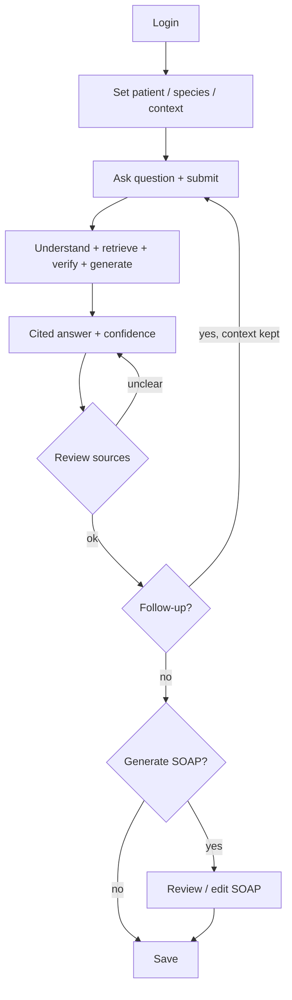

# Veterinary Clinical Intelligence Platform — Product Flow Specification

**Document status:** Draft v1.0 · Consistent with [`PRD.md`](./PRD.md) and [`ARCHITECTURE_SPEC.md`](./ARCHITECTURE_SPEC.md)
**Date:** 2026-09-27
**Owner:** Product / UX / Engineering
**Purpose:** Describe every important flow through the product as a chain of *User action → System action → Decision → Next step → User-visible result*, then trace the "cat with suspected kidney disease" example end-to-end without skipping steps.

**How to read this document.** Each flow is a table using the five columns above. Component and endpoint names match the architecture spec exactly (e.g. Scope Guardrail, Clarification Gate, Citation Verification gate, Provenance Capture). Endpoints in `code` are `[PROPOSED]`; nothing is invented. Where behaviour depends on an undecided threshold or policy, it is marked `PROPOSED — TBD`. The guiding rule from the PRD holds throughout: **retrieve and verify before writing; the vet always decides.**

**Cross-cutting behaviours that apply to every flow** (so they are not repeated in each table):
- Every request passes the authenticated Gateway; an expired/invalid session sends the vet to re-login (see Flow 12).
- Every step emits audit events to the Audit/Observability Store (PRD FR-022 / SAF-007).
- Any component failure follows the Error/Failure flow (Flow 12) — degrade honestly, never fabricate.
- Species is carried on every internal call once known (PRD AI-003).

---

## Flow 1 · Primary Veterinarian User Flow (the spine)

The top-level journey. The other flows are expansions of individual steps here.

| User action | System action | Decision | Next step | User-visible result |
|---|---|---|---|---|
| Opens the app | Gateway checks session/credentials | Valid session? | If no → login; if yes → home | Home screen or login prompt |
| Logs in | Auth verifies identity + role (`OIDC/JWT` `[PROPOSED]`) | Authenticated & authorised? | If no → error; if yes → dashboard | "Signed in" / access to clinical query |
| Starts a new query | System opens query workspace, prompts for patient/species/context | — | Patient Context flow (Flow 3) | Empty query form with context fields |
| Enters context + asks question | System validates and submits (`POST /api/v1/clinical/query` `[PROPOSED]`) | In scope? Species clear? | New Clinical Query flow (Flow 2) | Progress indicator ("understanding → retrieving → verifying → writing") |
| Waits | System runs understanding → DAT retrieval → synthesis → verification → generation | Evidence sufficient? | Evidence/DAT/Verification flows (4–8) | Live stage feedback, not a frozen screen |
| Reads the cited answer | System displays answer with visible, openable citations + confidence/flags | Citations clear? | Human Review flow (Flow 11) | Structured answer; each claim shows its source |
| Opens a source | System reveals the exact passage behind the claim | Source supports claim? | Stay on answer or ask follow-up | Source passage shown inline |
| Asks a follow-up | System reuses retained context, runs a new subquery | Same case? | Follow-up flow (Flow 9) | New cited answer, context preserved |
| Requests a SOAP note | System generates SOAP from the verified answer | Vet approves after edit? | SOAP flow (Flow 10) + Review (Flow 11) | Editable S/O/A/P note with citations |
| Saves | System persists to the case | — | (Export = FUTURE) | "Saved" confirmation |

---

## Flow 2 · New Clinical Query Flow

From submitting a question to the point where the DAT run is dispatched. This is where the Scope Guardrail and Clarification Gate (from the architecture spec) act.

| User action | System action | Decision | Next step | User-visible result |
|---|---|---|---|---|
| Submits question + context | Gateway authenticates, forwards to Query Understanding | Authenticated? | If no → login (Flow 12) | Progress: "understanding your question" |
| — | Query Understanding extracts intent/entities; **Scope Guardrail** checks domain | In clinical scope? | If out of scope → return `{out_of_scope}` (no DAT run) | If out of scope: polite redirect explaining the product's purpose |
| — | Species Detection computes species + confidence | Confidence ≥ threshold (`PROPOSED — TBD`)? | If low → **Clarification Gate** returns `{needs_clarification}` | If unclear: "Which species is this? [Cat] [Dog] …" |
| Confirms species (if asked) | System resumes with confirmed species | — | Concept Mapping | Progress continues |
| — | Concept Mapping maps terms → SNOMED/VeNom/LOINC (`POST /api/v1/ontology/map` `[PROPOSED]`) | Terms mapped? | Unmapped terms flagged, not dropped | (Internal; species chip shown) |
| — | Query Decomposition splits into subqueries | — | Dispatch to DAT Root (`POST /api/v1/agents/route` `[PROPOSED]`) | Progress: "retrieving evidence" |

**Decision summary:** two early exits protect the vet's time and trust — out-of-scope (no retrieval) and low-confidence species (ask before assuming). Both are PROPOSED components resolving PRD gaps GAP-4 and GAP-1.

---

## Flow 3 · Patient Context Flow

How patient/species/context is captured, retained, and reused (PRD FR-002/FR-003).

| User action | System action | Decision | Next step | User-visible result |
|---|---|---|---|---|
| Starts a query | Session/Case Service opens/loads a case | Existing case? | If yes → load from Patient/Context Store | Context fields pre-filled or blank |
| Enters patient + species + signs/labs | System stores structured context in Patient/Context Store | Required fields present? | If species missing → detection (Flow 2) | Context saved to the case |
| Attaches an image/report | System stores it as **attached context only** (V1) | — | Not interpreted in V1 (FUTURE, GAP-7) | File attached; note "not analysed in this version" |
| Asks a follow-up later | Orchestrator reads context from the store | Same session/case? | Reuse without re-entry (Flow 9) | Vet not asked to re-enter patient details |
| Edits context | System updates the stored context | — | Applies to subsequent queries | Updated context reflected |

**Consistency note:** context is read by the orchestrator on every query and is access-controlled (PRD DP-003). It is never sent to any external service in V1.

---

## Flow 4 · Evidence Retrieval Flow

What each retrieval child does with its source (PRD FR-008–FR-010). This is one "lane"; several run in parallel under the DAT (Flow 5).

| User action | System action | Decision | Next step | User-visible result |
|---|---|---|---|---|
| (none — automatic) | Root dispatches a scoped subquery to a retrieval child | — | Child performs its lookup | Progress: "retrieving evidence" |
| — | **Literature agent**: `embed_query()` → `POST /api/v1/retrieval/search` (top-k) → local re-rank | Passages found? | If none → return empty + low confidence | (Internal) |
| — | **Clinical Reasoning / Specialist**: query Textbook KG for established facts | Facts found? | If none → reduced coverage flagged | (Internal) |
| — | **Ontology/Concept**: expand concepts in Ontology Store | Expansion available? | If not → base concepts only | (Internal) |
| — | **Pharmacology**: lookup by `{drug, species}` | Species-specific data exists? | If not → return `{no_data}` — **never a substitute dose** | (Internal; contributes to answer or a "no dosing data" note) |
| — | **Provenance Capture** writes `source_id ↔ span` to Citation/Evidence Store | Write ok? | If fail → retry + alert (Flow 12) | (Internal; enables "open source" later) |
| — | Each child returns `{evidence[], source_ids[], confidence, metadata}` to Root | — | Synthesis (Flow 5 → 7) | (Internal) |

**Key rule (PRD AI-001):** retrieval always precedes writing. A child that finds nothing returns "nothing," and that gap is surfaced honestly (Flow 8) — the LLM is never asked to fill it from memory.

---

## Flow 5 · DAT Agent Execution Flow

How the Root/Router coordinates the children (PRD FR-007; architecture §3), including the degradation policy (GAP-5).

| User action | System action | Decision | Next step | User-visible result |
|---|---|---|---|---|
| (none) | Root receives `{subqueries[], concepts[], species}`, writes run to Agent-State | — | Fan-out | Progress: "consulting specialists" |
| — | Root dispatches to all relevant children **in parallel (async)** | — | Children run independently (Flow 4, 6) | (Internal) |
| — | Children work; **none talk to each other** (parent↔child only) | — | Each returns to Root | (Internal) |
| — | Root waits at a barrier for returns | All returned before timeout `T`? | If yes → proceed | (Internal) |
| — | If some children time out | Quorum `Q` met? (`T`, `Q` = `PROPOSED — TBD`) | If yes → proceed with partial + `flags[]`; if no → graceful error (Flow 12) | If partial: answer shown with a "based on partial evidence" flag |
| — | Root sends collected evidence to Synthesis (`POST /api/v1/synthesis` `[PROPOSED]`) | — | Synthesis → Verification (Flow 7) | Progress: "combining evidence" |

**Non-negotiable:** synthesis starts only after the barrier (PRD AI-006). The tree never loops sideways (PRD AI-005).

---

## Flow 6 · Specialist Consultation Flow

How a specialist agent (e.g. Internal Medicine) contributes (PRD FR-011). It is a child of the DAT, invoked only when the query touches its domain.

| User action | System action | Decision | Next step | User-visible result |
|---|---|---|---|---|
| (none) | Root decides which specialists are relevant to the subqueries | Domain match? | If none relevant → no specialist dispatched | (Internal) |
| — | Relevant specialist(s) dispatched in parallel with other children | — | Specialist queries Textbook KG for domain facts | Progress: "consulting internal medicine" (example) |
| — | Specialist analyses within its domain, conditioned on species | Domain facts found? | If sparse → return findings + low confidence | (Internal) |
| — | Specialist returns `{specialist_findings[], source_ids[], confidence}` to Root | — | Synthesis (Flow 7) | Findings appear (cited) in the combined answer |
| — | If a specialist is unavailable | Others sufficient (quorum)? | Skip + flag that domain (Flow 12) | Answer notes the domain was not covered |

**V1 note:** at least one specialist ships (proposed: Internal Medicine); the full set (Oncology/Dentistry/Anesthesia) is `OQ-9` in the PRD.

---

## Flow 7 · Citation Verification Flow

The trust gate (PRD FR-013, AI-007; architecture §7). This is the single authoritative verification, resolved from the earlier ambiguity (CON-1): it runs **after synthesis, before generation**.

| User action | System action | Decision | Next step | User-visible result |
|---|---|---|---|---|
| (none) | Synthesis produces `{candidate_answer, claim_source_map, confidence, conflicts[]}` | — | Send to Citation Verification | Progress: "verifying sources" |
| — | Citation Verification reads spans/DOIs from Citation/Evidence Store; **deterministically** matches each claim to its source | Claim supported by its source? | If yes → keep as verified; if no → mark unverified | (Internal) |
| — | Unverified claims are dropped or explicitly flagged (never shown as supported facts) | Any claims survive? | If none survive → Low-Evidence flow (Flow 8) | (Internal) |
| — | Safety/Grounding removes any residual ungrounded content; enforces species/drug safety | Grounded + safe? | Ungrounded/unsafe → reject | (Internal) |
| — | Approved citations + grounded context passed to LLM | — | Generation (Flow → answer) | Progress: "writing answer" |
| — | LLM writes over verified context only | — | Answer returned with citations, confidence, flags | Cited answer; each claim openable to its source |

**Determinism (PRD NFR-008):** the same inputs always yield the same verification result; verification does not rely on the model's judgment.

---

## Flow 8 · Low-Evidence / No-Evidence Flow

What happens when the evidence is thin, conflicting, or absent (PRD FR-020, SAF-004, SAF-008). This flow is a first-class product behaviour, not an error.

| User action | System action | Decision | Next step | User-visible result |
|---|---|---|---|---|
| (none) | Synthesis + Uncertainty Aggregation computes answer confidence + conflict flags | Confidence low? Conflicts present? | If low/conflicting → set flags | (Internal) |
| — | After verification, few or no claims survive | Any verified claims at all? | If some → answer with prominent low-evidence flag; if none → no-evidence response | Answer clearly marked "limited evidence" **or** an honest "not enough evidence in our sources" |
| — | Conflicting sources detected | Reconcilable deterministically? | No → present the conflict, do not silently pick one | Both positions shown, each cited, conflict noted |
| — | Question falls outside ingested knowledge | In sources? | If not → bounded-knowledge honesty (SAF-008) | "This isn't covered by our current sources" — no fabrication |
| Reads the honest result | System offers to refine the question or add context | — | Follow-up (Flow 9) | Vet can narrow/rephrase; decision stays with the vet |

**Why this matters:** an honest "we don't have strong evidence here" is a success state, not a failure. The product never manufactures confidence.

---

## Flow 9 · Follow-up Question Flow

Asking a related question within the same case (PRD FR-003, Use Case 5).

| User action | System action | Decision | Next step | User-visible result |
|---|---|---|---|---|
| Asks a follow-up | Orchestrator reuses retained patient/species/context (no re-entry) | Same case/session? | If yes → skip context capture | Follow-up accepted without re-asking patient details |
| — | Runs a fresh understanding → DAT → verification cycle for the new subquery | In scope? Species still valid? | Scope/Clarification as in Flow 2 | Progress feedback |
| — | New evidence retrieved and verified; prior answer remains available | — | Citation Verification (Flow 7) | New cited answer alongside the prior one |
| Compares answers | System keeps the case thread coherent | — | Ask again, or move to SOAP (Flow 10) | Conversation-in-context, each answer independently cited |

**Boundary:** "context retained" means patient/species/case data is reused — it does **not** mean the LLM answers from prior conversation memory. Each answer is freshly retrieved and verified.

---

## Flow 10 · SOAP Generation Flow

Turning a verified answer into a clinical note (PRD FR-016–FR-018, §14). Opt-in and reviewed.

| User action | System action | Decision | Next step | User-visible result |
|---|---|---|---|---|
| Requests a SOAP note | System calls SOAP Generator with the **verified** answer + context (`POST /api/v1/soap/generate` `[PROPOSED]`) | Verified answer exists? | If not → must run a query first | Progress: "drafting SOAP note" |
| — | SOAP Generator maps evidence to S/O/A/P; **citations carried through** | All four sections populated? | If a section lacks evidence → left sparse + flagged, not fabricated | Draft note with S/O/A/P + citations |
| Reviews the draft | System presents each section as editable, with sources visible | — | Human Review (Flow 11) | Editable note; nothing saved yet |
| Edits sections | System captures the edit delta | — | Save | Vet's edits reflected |
| Saves | System persists to case; **edit-provenance** (AI vs vet) written to Audit Store (GAP-2) | — | (Export = FUTURE) | "Saved"; record notes what was AI-drafted vs vet-edited |

**Safety:** SOAP is built from the already-verified answer, not a new ungrounded generation, and cannot be saved without vet review (PRD SAF-006).

---

## Flow 11 · Human Review Flow

The vet-in-control checkpoints that appear across the product (PRD SAF-003, SAF-006, UX-005).

| User action | System action | Decision | Next step | User-visible result |
|---|---|---|---|---|
| Reads a cited answer | System presents evidence + options, never a directive | Vet satisfied with sourcing? | If unclear → open source (below) | Answer framed as support, not instruction |
| Opens a citation | System reveals the exact source passage | Does the source support the claim? | If not, vet can disregard that claim | Source passage inline |
| Reviews a SOAP draft | System requires explicit review before save | Approved? | If not approved → cannot save | Save disabled until reviewed |
| Edits content | System records AI-vs-vet provenance | — | Save (Flow 10) | Edits attributed in the audit record |
| Makes the clinical decision | System logs that the vet decided; takes no autonomous clinical action | — | End / next query | The vet's decision stands; the platform supported it |

**Principle:** at no point does the platform state a diagnosis or prescription as its own decision (PRD SAF-003). Records require a human before they become records.

---

## Flow 12 · Error / Failure Flow

How the system behaves when something breaks (PRD AI-008, NFR-004, SAF-009). The rule: **degrade honestly, never fabricate.**

| Trigger | System action | Decision | Next step | User-visible result |
|---|---|---|---|---|
| Invalid/expired session | Gateway rejects (401/403) | Re-auth possible? | Send to login | "Please sign in again" |
| Rate limit hit | Gateway returns 429 | — | Ask to retry shortly | "Too many requests — try again in a moment" |
| Out-of-scope request | Scope Guardrail returns `{out_of_scope}` | — | No DAT run | Polite redirect to product's purpose |
| Low species confidence | Clarification Gate returns `{needs_clarification}` | — | Await vet input (Flow 2) | Species confirmation prompt |
| A child agent times out | Root applies timeout/quorum (GAP-5) | Quorum met? | If yes → partial + flag; if no → graceful error | "Answer based on partial evidence" **or** "Couldn't complete — please retry" |
| A retrieval source is down | Child returns empty + low confidence | Others sufficient? | Reduced answer + flag (Flow 8) | Answer notes the missing dimension |
| Verification finds nothing supported | No verified claims | — | No-evidence response (Flow 8) | "Not enough evidence in our sources" |
| LLM/model unavailable | Generation fails | Retry succeeds? | If not → graceful error | "Temporarily unable to generate — please retry" (no fabricated answer) |
| Store write fails (provenance/audit/save) | Retry; alert; do not lose vet edits | Recovered? | If not → surface error, preserve local state | Error shown; entered data not lost |

**Never:** on any failure the system does **not** invent content, does not present an unverified claim as fact, and does not save a record without review.

---

## Detailed Sequence — "Cat with suspected kidney disease"

**Scenario:** a vet enters a feline patient and asks *"Cat with suspected kidney disease — likely causes and how should I work it up?"* Species = **feline**; concept = **chronic kidney disease (CKD) / renal disease**.

This sequence shows **every meaningful interaction** — service and API boundaries, each DAT child, retrieval, provenance capture, synthesis, deterministic citation verification, safety/grounding, LLM generation, and the final response — plus the optional SOAP step. Intermediate steps are intentionally **not** collapsed.

```mermaid
sequenceDiagram
  autonumber
  actor VET as Veterinarian (UI)
  participant GW as API Gateway + Auth
  participant QU as Query Understanding + Scope Guardrail
  participant SD as Species Detection + Clarification Gate
  participant PCS as Patient/Context Store
  participant CM as Concept Mapping
  participant ONTS as Ontology Store
  participant QD as Query Decomposition
  participant RT as DAT Root/Router
  participant ASE as Agent-State Store
  participant CR as Clinical Reasoning (child)
  participant LIT as Literature/PMC (child)
  participant IM as Internal Medicine (specialist child)
  participant PH as Pharmacology (child)
  participant PROV as Provenance Capture (child)
  participant EMB as Embedding Model (TBD)
  participant VIDX as PMC Vector Index (TBD)
  participant RRK as Re-ranker (TBD)
  participant KG as Textbook KG
  participant PHDB as Pharmacology DB
  participant CES as Citation/Evidence Store
  participant SYN as Synthesis + Uncertainty
  participant CV as Citation Verification (gate)
  participant SG as Safety / Grounding
  participant LLM as Foundation LLM (TBD)
  participant SOAP as SOAP Generator
  participant AOS as Audit/Observability Store

  %% ---- Entry + auth ----
  VET->>GW: POST /api/v1/clinical/query [PROPOSED]<br/>{vet_id, patient, species:"cat"?, text:"suspected kidney disease..."}
  GW->>GW: authenticate() + authorize(RBAC) [PROPOSED]
  GW->>AOS: audit(access, trace_id)
  GW->>QU: {query_id, text, patient_ctx}

  %% ---- Understanding + scope + species ----
  QU->>PCS: read patient context {patient_id}
  PCS-->>QU: {patient_ctx: feline, age, signs?}
  QU->>QU: extract intent/entities + Scope Guardrail check
  Note over QU: In clinical scope -> continue (else {out_of_scope})
  QU->>SD: detect_species()
  SD-->>QU: {species:"feline", confidence:0.98}
  Note over SD: confidence >= threshold -> no clarification needed (else {needs_clarification})

  %% ---- Concept mapping + decomposition ----
  QU->>CM: map_query_to_concepts()
  CM->>ONTS: POST /api/v1/ontology/map [PROPOSED] {"kidney disease","cat"}
  ONTS-->>CM: {snomed:CKD, venom:renal-dz, loinc:[creatinine,SDMA,BUN,UPC,USG]}
  CM->>QD: decompose_query()
  QD-->>QU: {subqueries:[etiology, diagnostics, staging, therapeutics]}
  QU->>RT: POST /api/v1/agents/route [PROPOSED] {subqueries[], concepts[], species:"feline", patient_ctx}
  RT->>ASE: write run {run_id, nodes, status:dispatched}

  %% ---- DAT fan-out (parallel, parent<->child only) ----
  Note over RT,PROV: Root fans out to children IN PARALLEL. Children never talk to each other.
  par Clinical Reasoning
    RT->>CR: dispatch {etiology + differentials, feline}
    CR->>KG: query_facts(feline CKD causes)
    KG-->>CR: {facts[], node_ids[]}
    CR-->>RT: {evidence[], source_ids[], confidence:0.86}
  and Literature / PMC
    RT->>LIT: dispatch {PMC evidence: causes + diagnostics, feline}
    LIT->>EMB: embed_query(subquery)
    EMB-->>LIT: {query_vector}
    LIT->>VIDX: POST /api/v1/retrieval/search [PROPOSED] retrieve_top_k(k=20)
    VIDX-->>LIT: {passages[20], doc_ids[], scores[]}
    LIT->>RRK: rerank_evidence(passages)
    RRK-->>LIT: {ranked_passages[], scores[]}
    LIT-->>RT: {passages[], doc_ids[], confidence:0.81}
  and Internal Medicine (specialist)
    RT->>IM: dispatch {feline nephrology workup: IRIS staging, dx protocol}
    IM->>KG: query_facts(IRIS staging, diagnostic protocol)
    KG-->>IM: {facts[], node_ids[]}
    IM-->>RT: {specialist_findings[], source_ids[], confidence:0.88}
  and Pharmacology
    RT->>PH: dispatch {renal-relevant drugs, feline dosing}
    PH->>PHDB: lookup_drug(species:"feline") {benazepril, telmisartan, phosphate binders}
    PHDB-->>PH: {dose_by_species, side_effects[], interactions[], source_ids[]}
    PH-->>RT: {drugs[], dosing, interactions[], confidence:0.84}
  and Provenance Capture
    RT->>PROV: dispatch {capture provenance for retrieved evidence}
    PROV->>CES: write {source_id, span, doc_id, uri, date}
    CES-->>PROV: ack
    PROV-->>RT: {provenance_written:true}
  end
  RT->>ASE: update run {status:collected}

  %% ---- Synthesis + uncertainty ----
  RT->>SYN: POST /api/v1/synthesis [PROPOSED] {all evidence[], findings[], source_ids[]}
  SYN->>SYN: cross-source rank + specialist synthesis + parent synthesis + Uncertainty Aggregation
  SYN-->>RT: {candidate_answer, claim_source_map, confidence:0.83, conflicts:[]}

  %% ---- Deterministic verification (AFTER synthesis, BEFORE generation) ----
  RT->>CV: POST /api/v1/citations/verify [PROPOSED] {claims[], claim_source_map}
  CV->>CES: read spans/DOIs for source_ids
  CES-->>CV: {spans[], dates[]}
  CV->>CV: deterministic span<->claim match
  CV-->>RT: {verified[], unverified[] dropped, citations[]}
  Note over CV: At least one verified claim -> continue (else Low-Evidence flow, no fabrication)

  %% ---- Safety / grounding ----
  RT->>SG: safety_grounding_check({verified_claims, citations})
  SG->>SG: drop ungrounded + enforce species/drug safety (no dose without feline data)
  SG-->>RT: {grounded_context, approved_citations[], rejects[]}

  %% ---- Generation over verified context ONLY ----
  RT->>LLM: invoke_llm(grounded_context, approved_citations) [PROPOSED]
  Note over LLM: Writes ONLY over verified context. Not a knowledge source.
  LLM-->>RT: {draft_cited_answer, confidence, flags[]}
  RT->>ASE: update run {status:complete}

  %% ---- Response back to vet ----
  RT-->>GW: {answer, citations[], confidence, flags[]}
  GW->>AOS: audit(result, trace_id, verified/rejected counts)
  GW-->>VET: 200 OK {answer:"likely feline CKD causes + staged diagnostic workup (creatinine, SDMA, BUN, UPC, USG, blood pressure, imaging)", citations[], confidence, flags[]}

  %% ---- Vet reviews sources ----
  VET->>GW: open citation(source_id)
  GW-->>VET: source passage (from CES via response payload)

  %% ---- Optional SOAP ----
  opt Vet requests SOAP note
    VET->>GW: POST /api/v1/soap/generate [PROPOSED] {answer, patient_ctx, citations[]}
    GW->>SOAP: generate_soap()
    SOAP-->>GW: {soap:{S,O,A,P}, citations[]}
    GW-->>VET: 200 OK {soap, citations[]}
    VET->>GW: save(approved_soap, edits)
    GW->>AOS: audit(soap_saved, ai_vs_vet_provenance)
    GW-->>VET: 200 OK {saved:true}
  end
```

**What the vet sees at the end:** a structured answer for feline CKD — likely causes, and a staged diagnostic workup including the relevant labs (creatinine, SDMA, BUN, urine protein:creatinine, urine specific gravity) plus blood pressure and imaging — where **every claim is openable to its source**, drug information is **feline-specific** (or explicitly "no data" rather than a cross-species dose), the answer-level **confidence and any flags** are visible, and the whole thing can become a **reviewed SOAP note**. The vet decides; every step was audited.

**Steps deliberately kept in (not collapsed):** the patient-context read; the Scope Guardrail and species-confidence checks (with their alternate exits noted); ontology mapping; decomposition; the parallel fan-out with each child's own retrieval sub-steps (embed → search → re-rank for Literature; KG lookups for reasoning/specialist; species-keyed DB lookup for pharmacology); Provenance Capture writing to the Citation/Evidence Store; the Agent-State writes; synthesis with uncertainty aggregation; the deterministic verification reading spans from the store; safety/grounding; generation over verified context only; the audit writes; the citation-open interaction; and the full optional SOAP save with edit-provenance.

---

## Flow ↔ requirement / architecture map

| Flow | Primary PRD requirements | Architecture view |
|---|---|---|
| 1 Primary user | §8 journey, UX-001..010 | §1 High-Level |
| 2 New query | FR-004/005/006, FR-021 (GAP-4), GAP-1 | §5 Online Query |
| 3 Patient context | FR-002/003, DP-003, GAP-7 | §5, §8 |
| 4 Evidence retrieval | FR-008/009/010, AI-001 | §2, §3 |
| 5 DAT execution | FR-007, AI-005/006, GAP-5 | §3 DAT |
| 6 Specialist | FR-011 (OQ-9) | §3 DAT |
| 7 Citation verification | FR-013, AI-007, NFR-008 (CON-1) | §7 Security & Trust |
| 8 Low/No-evidence | FR-020, SAF-004/008, AI-004 (GAP-3) | §5, §7 |
| 9 Follow-up | FR-003 | §5 |
| 10 SOAP | FR-016/017/018 (GAP-2) | §6 SOAP |
| 11 Human review | SAF-003/006, UX-005 | §6, §7 |
| 12 Error/failure | AI-008, NFR-004, SAF-009 | §3, §5, §7 |

---

*This flow specification is consistent with [`PRD.md`](./PRD.md) and [`ARCHITECTURE_SPEC.md`](./ARCHITECTURE_SPEC.md): component and endpoint names match, the same PROPOSED gap-closing components appear, and the "retrieve → synthesize → verify → generate; vet decides" ordering is preserved in every flow.*
