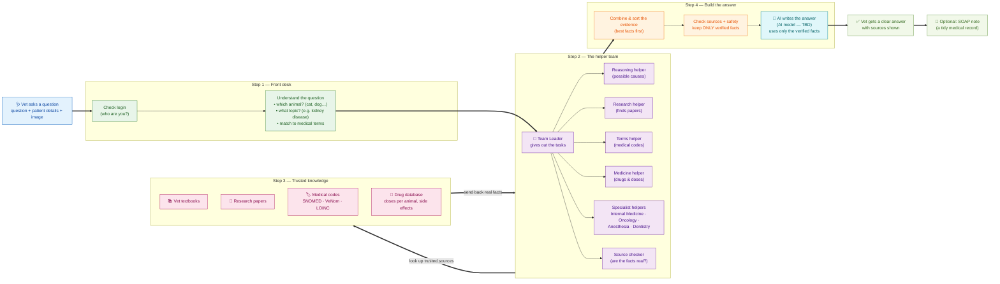

# Simple Flow — The Full Picture, Made Easy

This shows **everything the system does**, but in plain language — no technical wiring.
Read it left to right: the vet asks, a team of helpers gathers trusted facts, the facts are
checked, and the AI writes a clear, sourced answer.

---

## The whole story in a few lines

> A vet asks a question. The system checks who they are and works out **which animal** and
> **what topic** it's about. A **team of helpers** (led by one leader) goes and looks things up
> in **trusted sources** — vet textbooks, research papers, medical code lists, and a drug database.
> The helpers bring back real facts, the system **keeps only what's verified**, and then the
> **AI writes the final answer using just those facts** — with the sources shown. If the vet wants,
> it can also make a **SOAP note** (a neat medical record).

## What each step does (plain words)

**Step 1 — Front desk**
- **Check login:** makes sure the person is allowed to use the system.
- **Understand the question:** works out the animal, the topic, and matches everyday words to
  official medical terms so nothing gets confused.

**Step 2 — The helper team**
- A **Team Leader** hands out jobs and collects the results. The helpers work **at the same time**:
  - *Reasoning* — thinks about possible causes.
  - *Research* — finds relevant papers.
  - *Terms* — handles medical codes.
  - *Medicine* — looks up drugs and correct doses for that animal.
  - *Specialists* — expert helpers for Internal Medicine, Cancer, Anesthesia, and Dentistry.
  - *Source checker* — makes sure every fact is real and traceable.
- The helpers only report to the **leader** — this keeps things simple and organized.

**Step 3 — Trusted knowledge**
- The real facts come from **textbooks, research papers, medical code lists, and a drug database**.
- Important: facts come from **these trusted sources**, *not* from the AI's imagination.

**Step 4 — Build the answer**
- **Combine & sort:** put the most useful facts first.
- **Check sources + safety:** throw away anything not backed by a real source.
- **AI writes the answer:** the AI model turns the verified facts into a clear reply.
  It is **only the writer** — it can't add facts of its own. *(Which exact AI model to use is still to be decided.)*

**Final**
- **The vet gets a clear answer** with the sources shown, so they can trust and double-check it.
- **Optional SOAP note:** the answer can be saved as a standard medical record.

## The one rule that keeps it safe

> **Find the real facts first — then let the AI write.**
> Every fact in the answer can be traced back to a trusted source.
