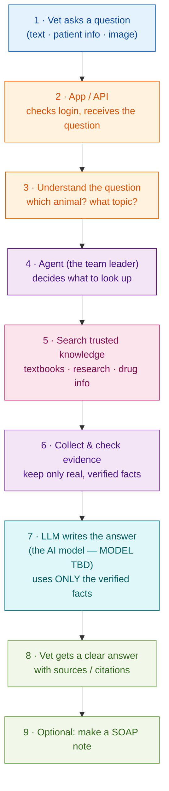

# Simple Flow — How It Works (Step by Step)

A clean, easy version of the architecture. Just follow the arrows from top to bottom.

---

## In one sentence

> The vet asks → the app understands the question → the **Agent** looks up trusted sources →
> the evidence is checked → the **LLM (AI model)** writes the answer using only that evidence →
> the vet gets a clear, cited answer (and can save it as a SOAP note).

## The 9 steps in plain words

1. **Vet asks a question.** They can add the animal's details or a photo/lab report.
2. **App / API.** The front door — checks who you are and takes in the question.
3. **Understand the question.** Works out the animal (cat, dog…) and the topic (e.g. kidney disease).
4. **Agent (team leader).** Decides what needs to be looked up to answer well.
5. **Search trusted knowledge.** Looks in vet textbooks, research papers, and drug data —
   **not** from the AI's memory.
6. **Collect & check evidence.** Gathers the findings and keeps only facts that are real and verified.
7. **LLM writes the answer.** The AI model turns the verified facts into a clear reply.
   It is **only the writer** — it can't add facts of its own. *(Which exact model to use is still TBD.)*
8. **Vet gets the answer.** Clear, with the sources shown so the vet can trust and check it.
9. **Optional SOAP note.** Turn the answer into a standard medical record if wanted.

**The golden rule:** *find the facts first, then let the AI write.* This keeps the answers safe and trustworthy.
